## 1\. Introduction

It is a great honor and pleasure for us to dedicate this paper to Professor Gabor Palinkas on the occasion of his 80th birthday. M. Holovko (MH) remembers his first meeting with Gabor during School on Ionic [Solvation](https://www.sciencedirect.com/topics/materials-science/solvation) in 1983 in Lviv. The following year they met in Veshprem at the Liquids and Solutions Conference organized by Gabor. After that they met many times during different EMLG meetings in different places. In particular, they met at EMLG-2000 meeting in Regensburg when Gabor was elected chairman of EMLG. MH remembers also the EMLG-2007 meeting in Fukuoka where Gabor presented a great lecture on self-assembly in complex liquids.

Over the last decades considerable attention has been devoted to complex fluids exhibiting self-assembly phenomena, formation of aggregates and modulated mesoscale structures [\[1\]](https://www.sciencedirect.com/science/article/pii/S0167732222011904#b0005), [\[2\]](https://www.sciencedirect.com/science/article/pii/S0167732222011904#b0010), [\[3\]](https://www.sciencedirect.com/science/article/pii/S0167732222011904#b0015), [\[4\]](https://www.sciencedirect.com/science/article/pii/S0167732222011904#b0020), [\[5\]](https://www.sciencedirect.com/science/article/pii/S0167732222011904#b0025), [\[6\]](https://www.sciencedirect.com/science/article/pii/S0167732222011904#b0030), [\[7\]](https://www.sciencedirect.com/science/article/pii/S0167732222011904#b0035). A large variety of such fluids exists including certain colloidal dispersions, [block copolymer](https://www.sciencedirect.com/topics/earth-and-planetary-sciences/block-copolymer) melts, solutions of amphiphilic molecules, to name a few. The origin of their behaviour usually results from competition of interparticle interactions having simultaneously an attractive and a repulsive nature. These interactions can appear due to both the direct interactions (e.g. [Van der Waals forces](https://www.sciencedirect.com/topics/earth-and-planetary-sciences/van-der-waals-force), electrostatic) and indirect interactions via solvent (e.g. depletion forces), a combination of which can be modeled as an effective isotropic pair potential characterized by short-range attraction and long-range repulsion (SALR) beyond the particle core [\[8\]](https://www.sciencedirect.com/science/article/pii/S0167732222011904#b0040), [\[9\]](https://www.sciencedirect.com/science/article/pii/S0167732222011904#b0045), [\[10\]](https://www.sciencedirect.com/science/article/pii/S0167732222011904#b0050), [\[11\]](https://www.sciencedirect.com/science/article/pii/S0167732222011904#b0055), [\[12\]](https://www.sciencedirect.com/science/article/pii/S0167732222011904#b0060), [\[13\]](https://www.sciencedirect.com/science/article/pii/S0167732222011904#b0065), [\[14\]](https://www.sciencedirect.com/science/article/pii/S0167732222011904#b0070), [\[15\]](https://www.sciencedirect.com/science/article/pii/S0167732222011904#b0075). The SALR type of a pair potential is widely used to describe models of such fluids with competing interactions. Due to the features of this potential, inhomogeneities or microphases of certain sizes is observed in a particles structure, leading to clustering at low densities or forming spatial patterns at high densities [\[16\]](https://www.sciencedirect.com/science/article/pii/S0167732222011904#b0080), [\[17\]](https://www.sciencedirect.com/science/article/pii/S0167732222011904#b0085), [\[18\]](https://www.sciencedirect.com/science/article/pii/S0167732222011904#b0090), [\[19\]](https://www.sciencedirect.com/science/article/pii/S0167732222011904#b0095), [\[20\]](https://www.sciencedirect.com/science/article/pii/S0167732222011904#b0100), [\[21\]](https://www.sciencedirect.com/science/article/pii/S0167732222011904#b0105), [\[22\]](https://www.sciencedirect.com/science/article/pii/S0167732222011904#b0110), [\[23\]](https://www.sciencedirect.com/science/article/pii/S0167732222011904#b0115). Sizes of the inhomogeneities are mostly defined by the parameters of SALR potential, i.e. by interparticle distances at which the potential is attractive and where it becomes repulsive. When the attractive part of SALR potential is sufficiently broad, particles assemble into large clusters or into spatial patterned structures of mesoscopic scale. The particular shape of obtained patterns strongly depends on the particle density and temperature. Models of fluids with competing interactions described by the SALR potential have been the focus of extensive research due to their ability to describe spontaneous emergence in a homogeneous fluid of mesostructured phases of different morphologies [\[1\]](https://www.sciencedirect.com/science/article/pii/S0167732222011904#b0005). Developing a direct connection of dispersion micro- and meso- structure with the competing pair potential is therefore important for technological applications as the competition of the two features provides opportunities to engineer desirable properties of colloidal systems and formulate new materials [\[15\]](https://www.sciencedirect.com/science/article/pii/S0167732222011904#b0075), [\[16\]](https://www.sciencedirect.com/science/article/pii/S0167732222011904#b0080).

For systems with competing interactions in the bulk, a large body of research has been reported. The studies have been done in the framework of computer simulations [\[24\]](https://www.sciencedirect.com/science/article/pii/S0167732222011904#b0120), [\[26\]](https://www.sciencedirect.com/science/article/pii/S0167732222011904#b0130), [\[27\]](https://www.sciencedirect.com/science/article/pii/S0167732222011904#b0135), including those in combination with machine learning techniques [\[28\]](https://www.sciencedirect.com/science/article/pii/S0167732222011904#b0140), approaches such as Landau-Brazowski theory [\[29\]](https://www.sciencedirect.com/science/article/pii/S0167732222011904#b0145), integral equations [\[24\]](https://www.sciencedirect.com/science/article/pii/S0167732222011904#b0120), [\[25\]](https://www.sciencedirect.com/science/article/pii/S0167732222011904#b0125), [\[30\]](https://www.sciencedirect.com/science/article/pii/S0167732222011904#b0150), and [density functional theory](https://www.sciencedirect.com/topics/physics-and-astronomy/density-functional-theory) [\[25\]](https://www.sciencedirect.com/science/article/pii/S0167732222011904#b0125), [\[31\]](https://www.sciencedirect.com/science/article/pii/S0167732222011904#b0155), [\[32\]](https://www.sciencedirect.com/science/article/pii/S0167732222011904#b0160), [\[33\]](https://www.sciencedirect.com/science/article/pii/S0167732222011904#b0165). Far fewer results exist for systems under confinement. The latter may induce significant structural changes in the fluid, especially in the layers adjacent to the confining interfaces. For this reason, confined SALR systems have typically been investigated in two dimensions [\[34\]](https://www.sciencedirect.com/science/article/pii/S0167732222011904#b0170), [\[35\]](https://www.sciencedirect.com/science/article/pii/S0167732222011904#b0175), [\[36\]](https://www.sciencedirect.com/science/article/pii/S0167732222011904#b0180), although some results for the three dimensional case also exist. For instance, in [\[37\]](https://www.sciencedirect.com/science/article/pii/S0167732222011904#b0185) a SALR fluid confined in a slit-like pore was studied in the framework of a perturbative density functional approach. In [\[38\]](https://www.sciencedirect.com/science/article/pii/S0167732222011904#b0190), the structure and adsorption of a system with competing interactions confined by an attractive wall was investigated by means of computer simulations. Phase behavior of a harmonically confined [colloidal suspension](https://www.sciencedirect.com/topics/materials-science/colloidal-suspension) has been considered as well [\[39\]](https://www.sciencedirect.com/science/article/pii/S0167732222011904#b0195). In [\[40\]](https://www.sciencedirect.com/science/article/pii/S0167732222011904#b0200) the authors developed a mesoscopic theory for self-assembling systems near a planar confining [surface](https://www.sciencedirect.com/topics/immunology-and-microbiology/surface-property).

A popular SALR model is that of a two-Yukawa hard sphere fluid. Such a potential provides a reasonable description of dispersions of charged [colloidal particles](https://www.sciencedirect.com/topics/pharmacology-toxicology-and-pharmaceutical-science/colloidal-particle) in the presence of a depletant, and it is possible to tune its interaction parameters by varying physical conditions [\[41\]](https://www.sciencedirect.com/science/article/pii/S0167732222011904#b0205), [\[30\]](https://www.sciencedirect.com/science/article/pii/S0167732222011904#b0150). In contrast, in this work we propose to study a fluid interacting with a three-Yukawa potential of the SALR form. Such a model with a soft core takes into account the possibility of partial overlap between two particles. Examples of respective systems include, but are not limited to, [protein molecules](https://www.sciencedirect.com/topics/biochemistry-genetics-and-molecular-biology/protein), soft colloids, polymer grafted [nanoparticles](https://www.sciencedirect.com/topics/chemical-engineering/nanoparticle), star and other [branched polymers](https://www.sciencedirect.com/topics/materials-science/branched-polymer), [dendrimers](https://www.sciencedirect.com/topics/materials-science/dendrimer), microgels. Also a SALR potential presented in the form of a combination of Yukawa potentials has the advantage of making it possible to perform analytical calculations.

The goal of this study is to develop a theoretical approach capable of describing a soft core fluid with competing interaction modelled with the three-Yukawa (3Y) potential. Besides structural properties of a 3Y fluid in the bulk, a special attention is paid to predicting the density profile of this fluid near a hard wall. As a first step, we present theoretical results considered for the system at temperatures somewhat higher than clusters or patterned structures can form. Explicit analytical expressions for the pair correlation function and the density profile are derived. These expressions contain only parameters of the pair potential and the thermodynamic state, thus providing a link between microscopic parameters of the system and respective measurable quantities.

Since the model of a soft-core 3Y fluid with competing interactions is considered for the first time, we also present some preliminary results of computer simulations to demonstrate the ability of this fluid to form clusters and different patterned structures similar to those obtained for other SALR-type models known from the literature [\[24\]](https://www.sciencedirect.com/science/article/pii/S0167732222011904#b0120), [\[26\]](https://www.sciencedirect.com/science/article/pii/S0167732222011904#b0130), [\[27\]](https://www.sciencedirect.com/science/article/pii/S0167732222011904#b0135), [\[28\]](https://www.sciencedirect.com/science/article/pii/S0167732222011904#b0140), [\[31\]](https://www.sciencedirect.com/science/article/pii/S0167732222011904#b0155), [\[32\]](https://www.sciencedirect.com/science/article/pii/S0167732222011904#b0160), [\[33\]](https://www.sciencedirect.com/science/article/pii/S0167732222011904#b0165). Simulations also have enabled us to analyze the general phase behaviour of a 3Y fluid depending on the density and the temperature in the bulk and near hard walls, hence to determine parameters for the system, which are suitable to make a comparison with the results of our theory.

Therefore, the paper is organized as follows. First, in Section [2](https://www.sciencedirect.com/science/article/pii/S0167732222011904#s0010) we introduce the 3Y potential and its parameters used in our study. In Section [3](https://www.sciencedirect.com/science/article/pii/S0167732222011904#s0015) we present some computer simulations results for a 3Y fluid at different densities and temperatures to illustrate the relevance of the proposed potential and the chosen parameters. Next, we start to employ a [classical field theory](https://www.sciencedirect.com/topics/physics-and-astronomy/classical-field-theory) [\[42\]](https://www.sciencedirect.com/science/article/pii/S0167732222011904#b0210), [\[43\]](https://www.sciencedirect.com/science/article/pii/S0167732222011904#b0215) for a 3Y fluid in Section [4](https://www.sciencedirect.com/science/article/pii/S0167732222011904#s0020). In Section [5](https://www.sciencedirect.com/science/article/pii/S0167732222011904#s0025) we develop the field theory and obtain an analytical equation for the pair distribution function for a 3Y fluid in the bulk. In the same section we theoretically predict for the bulk 3Y fluid the region of the transition from a homogeneous state to inhomogeneous one at which microphases formation occurs. The final results are presented in Section [6](https://www.sciencedirect.com/science/article/pii/S0167732222011904#s0040), where the density profiles of a 3Y fluid are obtained near a hard wall in the mean field approximation numerically and from an analytical expression. The results found are tested against computer simulations data. The concluding remarks are presented in the last Section [7](https://www.sciencedirect.com/science/article/pii/S0167732222011904#s0045).

## 2\. The model

We study a fluid of soft particles interacting with a Three-Yukawa (3Y) potential given by(1)ν(r)\=A1rexp(\-α1r)+A2rexp(\-α2r)+A3rexp(\-α3r),where _r_ denotes the distance between two particles, Ai are the amplitudes of interaction and αi are the inverse ranges. The values of parameters Ai and αi are adjusted empirically to get a shape of the potential, which is appropriate for the SALR type of potential. Namely, we consider two sets of parameters which we will refer to as Models M1 (A1\=92.1106,α1\=1.463485,A2\=\-81.91964,α2\=1.0,A3\=16.07036,α3\=0.6) and M2 (A1\=150.6561,α1\=1.923254,A2\=\-122.613,α2\=1.26115,A3\=27.11811,α3\=0.75669). The respective shapes of these potentials are shown in [Fig. 1](https://www.sciencedirect.com/science/article/pii/S0167732222011904#f0005). We note that the Model M2, shown by the red dashed line, displays stronger long-range repulsion relative to the Model M1.

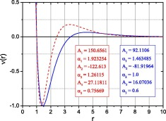

1.  [Download: Download high-res image (120KB)](https://ars.els-cdn.com/content/image/1-s2.0-S0167732222011904-gr1_lrg.jpg "Download high-res image (120KB)")
2.  [Download: Download full-size image](https://ars.els-cdn.com/content/image/1-s2.0-S0167732222011904-gr1.jpg "Download full-size image")

Fig. 1. Pair interaction potential [(1)](https://www.sciencedirect.com/science/article/pii/S0167732222011904#e0005) corresponding to the Model M1 (lower blue line) and M2 (upper red line) sets of parameter values.

Given the form of the interparticle interaction, it is convenient to introduce units of energy ε∗ and length σ∗ corresponding to the minimum of the potential and the smallest distance between two particles at which the potential turns to zero, i.e. ε∗\=νmin(r)\=ν(rmin) and ν(σ∗)\=0 with σ∗<rmin. Therefore, the quantity ε∗ is the depth of the attractive potential well and σ∗ is the diameter of particle soft core. Henceforth, the quantities with an asterisk are measured in real units while those without an asterisk will be non-dimensional and expressed in terms of ε∗ and σ∗, for example the temperature T\=kBT∗/ε∗, the density ρ\=ρ∗(σ∗)3, and the parameters of the potential Ai\=Ai∗/(σ∗ε∗),αi\=αi∗σ∗. Due to the softness of the core, the potential [(1)](https://www.sciencedirect.com/science/article/pii/S0167732222011904#e0005) makes it possible to take into account partial overlap between particles. The model can, therefore, describe effective pair interaction in a variety of [soft matter](https://www.sciencedirect.com/topics/physics-and-astronomy/soft-matter-physics) systems such as star-polymer blends, dispersions of polymer-grafted [nanoparticles](https://www.sciencedirect.com/topics/materials-science/nanoparticle), solutions of proteins, and microgel suspensions. In addition, due to its continuity the potential is convenient for analytical calculations.

## 3\. Computer simulations

A series of molecular dynamics (MD) computer simulations [\[44\]](https://www.sciencedirect.com/science/article/pii/S0167732222011904#b0220) have been performed to examine whether Models M1 and M2 can exhibit micro-segregation phenomena leading to different kinds of inhomogeneities and to estimate the ranges of temperatures and densities at which they occur. In addition, we were interested in the confinement effects for such systems. Having the intention to study purely the impact of confinement, we considered the case of hard walls, i.e. no attraction between the walls and the particles was taken into account. The MD simulations were performed in NVT ensemble using the Berendsen thermostat. In the bulk case the simulation box was taken of a cubic shape with the sizes L\=24 or L\=48 depending on scales of observed mesoscopic structures. The cutoff radius of 3Y potential was limited to rc\=12 in all cases. The [periodic boundary conditions](https://www.sciencedirect.com/topics/biochemistry-genetics-and-molecular-biology/periodic-boundary-conditions) were applied along three dimensions to the bulk system. It was noticed that for Model M1 the clusters formed due to self-assembly are much larger than in the Model M2, thus for the Model M1 preferably the larger was box used. To investigate the confinement effects of hard walls we have chosen the rectangular simulation box elongated in Z-direction such as Lx\=Ly\=24 and Lz\=48. In this case the [periodic boundary conditions](https://www.sciencedirect.com/topics/agricultural-and-biological-sciences/periodic-boundary-conditions) were applied only in X and Y directions, but in Z-direction the particle-wall reflection procedure was employed. The simulation timestep was δt\=0.01.

In parallel the conventional Monte-Carlo (MC) simulations [\[44\]](https://www.sciencedirect.com/science/article/pii/S0167732222011904#b0220) in the NVT ensemble were performed and compared with the MD simulations. Both approaches were in a good agreement and led to the same quantitative results. It was noticed, that MD simulations were faster in getting the reliable results for stable mesoscopic structures than the [method MC](https://www.sciencedirect.com/topics/physics-and-astronomy/monte-carlo-method) for the same number of particles. However, for a microstructure the MC provided more accurate results, which were needed for a comparison with pair distribution functions and density profiles obtained form the theory developed in our study.

In [Fig. 2](https://www.sciencedirect.com/science/article/pii/S0167732222011904#f0010), we present simulation snapshots for the Model M1 in the bulk. For comparison, [Fig. 3](https://www.sciencedirect.com/science/article/pii/S0167732222011904#f0015) shows simulation snapshots for the same system confined between two inert walls. One can see that at T\=10.0 the bulk fluid is uniform, while near the walls distinct clusters of particles are formed. As the temperature is raised, at T\=12.0 clusters disappear; however, some inhomogeneties at the walls still persist. From these facts we infer that confining walls trigger and favor micro-segregation effects for fluids with competing interactions. In [Fig. 4](https://www.sciencedirect.com/science/article/pii/S0167732222011904#f0020), [Fig. 5](https://www.sciencedirect.com/science/article/pii/S0167732222011904#f0025) some simulation snapshots for the Model M2 in the bulk are presented. Due to the fact that the potential M2 has more distinct shape than M1, the respective systems show richer phenomenological behavior. At high temperatures a uniform fluid is observed. As the temperature is decreased, the model exhibits spontaneous appearance in the system of a wide variety of mesostructures including lamellar and [gyroid](https://www.sciencedirect.com/topics/pharmacology-toxicology-and-pharmaceutical-science/gyroid) phases, hexagonal packed cylindrical phases, cubically ordered and disordered clusters formed by particles as well as voids. A transition to a modulated inhomogeneous phase can also be seen in the plots of the pair distribution function g(r) for the bulk M2 fluid and the density profile for a fluid at a confining wall ([Fig. 6](https://www.sciencedirect.com/science/article/pii/S0167732222011904#f0030), [Fig. 7](https://www.sciencedirect.com/science/article/pii/S0167732222011904#f0035)). At higher temperatures, the function g(r) displays a weak peak and rapidly tends to its asymptotic value of unity. However, for lower temperatures g(r) significantly enhances its value over a large length scale indicative of the cluster radius. For all the temperatures, the density profiles are characterized by distinct double maxima close to the wall. At higher temperatures the profile decays to its bulk value, while at lower temperatures the density displays oscillations signaling the presence of large scale ordering in the system. These effects are more pronounced in the case of higher density ρ\=0.75 ([Fig. 7](https://www.sciencedirect.com/science/article/pii/S0167732222011904#f0035)), which at T\=2.0 corresponds to a [lamellar structure](https://www.sciencedirect.com/topics/agricultural-and-biological-sciences/lamellar-structure) ([Fig. 5](https://www.sciencedirect.com/science/article/pii/S0167732222011904#f0025) on the right) and less prominent for a fluid with ρ\=0.25 ([Fig. 6](https://www.sciencedirect.com/science/article/pii/S0167732222011904#f0030)) corresponding to a spherical cluster phase at T\=2.0 ([Fig. 4](https://www.sciencedirect.com/science/article/pii/S0167732222011904#f0020) on the left). The aim of the present paper is to show that the soft core SALR potential [(1)](https://www.sciencedirect.com/science/article/pii/S0167732222011904#e0005) can describe spontaneous transition of a homogeneous fluid to mesoscopically inhomogeneous phases and to explore structural properties of such a fluid in the bulk and in the vicinity of a confining wall. In a series of papers on fluids with specific interactions [\[42\]](https://www.sciencedirect.com/science/article/pii/S0167732222011904#b0210), [\[43\]](https://www.sciencedirect.com/science/article/pii/S0167732222011904#b0215), [\[45\]](https://www.sciencedirect.com/science/article/pii/S0167732222011904#b0225), [\[46\]](https://www.sciencedirect.com/science/article/pii/S0167732222011904#b0230), [\[47\]](https://www.sciencedirect.com/science/article/pii/S0167732222011904#b0235), [\[48\]](https://www.sciencedirect.com/science/article/pii/S0167732222011904#b0240), [\[49\]](https://www.sciencedirect.com/science/article/pii/S0167732222011904#b0245), [\[50\]](https://www.sciencedirect.com/science/article/pii/S0167732222011904#b0250), [\[51\]](https://www.sciencedirect.com/science/article/pii/S0167732222011904#b0255), we show that it is possible to describe these systems using a field theoretical approach. To reproduce density profiles found from computer simulations and as a first step toward field theoretical description of fluids with competing interactions, in the present paper we apply this method to a fluid with the pair potential [(1)](https://www.sciencedirect.com/science/article/pii/S0167732222011904#e0005) in the mesoscopically homogeneous region of the phase space.

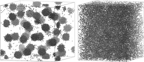

1.  [Download: Download high-res image (208KB)](https://ars.els-cdn.com/content/image/1-s2.0-S0167732222011904-gr2_lrg.jpg "Download high-res image (208KB)")
2.  [Download: Download full-size image](https://ars.els-cdn.com/content/image/1-s2.0-S0167732222011904-gr2.jpg "Download full-size image")

Fig. 2. MD snapshots in the bulk (Model M1) at T\=8.0,ρ\=0.25 (left) and T\=10.0,ρ\=0.25 (right).

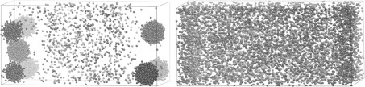

1.  [Download: Download high-res image (233KB)](https://ars.els-cdn.com/content/image/1-s2.0-S0167732222011904-gr3_lrg.jpg "Download high-res image (233KB)")
2.  [Download: Download full-size image](https://ars.els-cdn.com/content/image/1-s2.0-S0167732222011904-gr3.jpg "Download full-size image")

Fig. 3. MD snapshots for a fluid confined between two hard walls (Model M1) at T\=10.0,ρ\=0.25 (left) and T\=12.0,ρ\=0.25 (right). The walls are located on the left and right edges of the box.

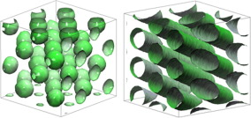

1.  [Download: Download high-res image (118KB)](https://ars.els-cdn.com/content/image/1-s2.0-S0167732222011904-gr4_lrg.jpg "Download high-res image (118KB)")
2.  [Download: Download full-size image](https://ars.els-cdn.com/content/image/1-s2.0-S0167732222011904-gr4.jpg "Download full-size image")

Fig. 4. MD snapshots for a bulk fluid (Model M2). BCC lattice of spherical clusters (left) and hexagonal ordered cylinders (right).

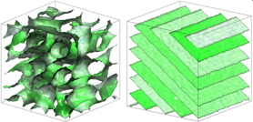

1.  [Download: Download high-res image (127KB)](https://ars.els-cdn.com/content/image/1-s2.0-S0167732222011904-gr5_lrg.jpg "Download high-res image (127KB)")
2.  [Download: Download full-size image](https://ars.els-cdn.com/content/image/1-s2.0-S0167732222011904-gr5.jpg "Download full-size image")

Fig. 5. MD snapshots for a bulk fluid (Model M2). Gyroid (left) and lamellar (right) structures.

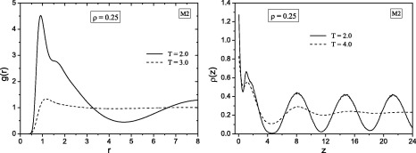

1.  [Download: Download high-res image (121KB)](https://ars.els-cdn.com/content/image/1-s2.0-S0167732222011904-gr6_lrg.jpg "Download high-res image (121KB)")
2.  [Download: Download full-size image](https://ars.els-cdn.com/content/image/1-s2.0-S0167732222011904-gr6.jpg "Download full-size image")

Fig. 6. The pair distribution functions (left) for a bulk fluid and the density profile for a fluid confined by a hard wall (right) for M2 parameters at ρ\=0.25. The temperature T\=2.0 corresponds to a spherical cluster phase. The results have been obtained from computer simulations.

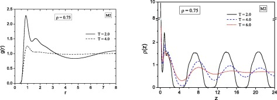

1.  [Download: Download high-res image (129KB)](https://ars.els-cdn.com/content/image/1-s2.0-S0167732222011904-gr7_lrg.jpg "Download high-res image (129KB)")
2.  [Download: Download full-size image](https://ars.els-cdn.com/content/image/1-s2.0-S0167732222011904-gr7.jpg "Download full-size image")

Fig. 7. Pair distribution functions as in [Fig. 6](https://www.sciencedirect.com/science/article/pii/S0167732222011904#f0030) for ρ\=0.75. The temperature T\=2.0 corresponds to a lamellar structure.

## 4\. Field theoretical approach

In the framework of the field theory (FT) formalism, the Hamiltonian of a classical system is a functional of the density field ρ(r) and is expressed as the sum of an entropic and an interaction terms(2)βH\[ρ(r)\]\=βHentr\[ρ(r)\]+βHint\[ρ(r)\],which respectively have the forms(3)βHentr\[ρ(r)\]\=∫ρ(r)lnρ(r)Λ3\-1dr(4)βHint\[ρ(r)\]\=β2∫ν(r)ρ(r1)ρ(r2)\-ρ(r1)δ(r1\-r2)dr1dr2,where kB is the Boltzmann constant, β\=1/kBT is the inverse temperature, ν(r) is the interaction potential between two particles at points 1 and 2 with r\=|r1\-r2|, and δ(r) is the Dirac function.

In the present work the calculations are carried out in the framework of the [canonical ensemble](https://www.sciencedirect.com/topics/physics-and-astronomy/canonical-ensemble) approach. Therefore, we are interested in the [partition function](https://www.sciencedirect.com/topics/biochemistry-genetics-and-molecular-biology/partition-coefficient) ZN expressed as(5)ZNρ(r)\=∫Dρ(r)exp{\-βH\[ρ(r)\]}.The number of particles is preserved by the relation ∫ρ(r)dr\=N or 1V∫ρ(r)dr\=ρ, where _V_ is the volume and ρ\=N/V is the [mean density](https://www.sciencedirect.com/topics/physics-and-astronomy/mean-matter-density). To ensure this condition, we define a [Lagrange multiplier](https://www.sciencedirect.com/topics/earth-and-planetary-sciences/lagrange-multiplier) λ such that(6)δβH\[ρ(r)\]δρ(r)\=λ.The logarithm of the [partition function](https://www.sciencedirect.com/topics/immunology-and-microbiology/partition-coefficient) produces the [Helmholtz free energy](https://www.sciencedirect.com/topics/chemical-engineering/gibbs-free-energy)(7)βF\=\-lnZN.The mean field (MF) description of the system corresponds to estimating the functional integral [(5)](https://www.sciencedirect.com/science/article/pii/S0167732222011904#e0015) in the saddle point approximation according to the condition(8)δβHδρρMF(r)\=λ.The fluctuations of density are taken into account by expanding the Hamiltonian around the field ρMF(r), i.e. writing ρ(r)\=ρMF(r)+δρ(r). This amounts to a general expression for the Hamiltonian(9)βHρ\=βHρMF+∫δρr1δβHδδρr1ρMFdr1+12∫δρr1δρr2δ2βHδδρr1δδρr2ρMFdr1dr2+∑n⩾3\-1nn\-1!n!∫δρr1…δρrnδnβHδδρr1…δδρrnρMFdr1…drn.The first term is essentially the functional [(2)](https://www.sciencedirect.com/science/article/pii/S0167732222011904#e0010) for the mean field density(10)βH\[ρMF\]\=∫ρMF(r1)lnρMF(r1)Λ3\-1dr1+β2∫ν(r)ρMF(r1)ρMF(r2)\-ρMF(r1)δ(r1\-r2)dr1dr2.The linear term vanishes as in the canonical ensemble the number of particles is fixed, i.e. ∫δρ(r)dr\=0. The terms of higher orders arise from the expansion of the logarithm function in Eq. [(3)](https://www.sciencedirect.com/science/article/pii/S0167732222011904#e0290).

## 5\. Three-Yukawa fluid in the bulk

In this section we apply field theory to study analytically the properties of a 3Y fluid in the bulk region. One point of interest is to investigate the conditions for the appearance of inhomogeneous phases, which is signaled by the divergence of the structure factor S(k). The curve separating the respective homogeneous and inhomogeneous phases (known as the λ\-line) is therefore determined by the locus of points at which S(k) diverges. This knowledge is also important for numerical calculations of the density profiles which we intend to perform within the homogeneous part.

### 5.1. The pair distribution function

The structure of a fluid can be described by the pair correlation function (PCF) h(r). This quantity can be found from the following expression [\[52\]](https://www.sciencedirect.com/science/article/pii/S0167732222011904#b0260)(11)h(r1,r2)〈ρ(r1)〉〈ρ(r2)〉\=〈δρ(r1)δρ(r2)〉\-δr1\-r2〈ρ(r1)〉.We expand the Hamiltonian with respect to the mean field density ρMF(r). Truncation of expansion [(9)](https://www.sciencedirect.com/science/article/pii/S0167732222011904#e0300) at the second term corresponds to the description of the system in the [Gaussian](https://www.sciencedirect.com/topics/biochemistry-genetics-and-molecular-biology/gaussian-distribution) approximation.

The quadratic term in Eq. [(9)](https://www.sciencedirect.com/science/article/pii/S0167732222011904#e0300) is(12)βH2\[ρ\]\=12∫δρ(r1)δρ(r2)δ(r1\-r2)ρMF(r1)+βν(r)dr1dr2,where the first term comes from the expansion of the logarithm in the entropic part of the Hamiltonian.

In order to calculate the averages using the [Gaussian](https://www.sciencedirect.com/topics/physics-and-astronomy/gaussian-distribution) integrals, it is necessary to have the quadratic term of the Hamiltnian in a diagonal form. For bulk properties we can expand the density on the Fourier components(13)δρ(r)\=∑k\>0δρkeikr.In this basis the quadratic Hamiltonian equals(14)βH2\[ρ\]\=V2ρ∑k\>0δρkδρ\-k1+ν(k),where(15)βν(k)\=∑i\=134πβAik2+αi2is the [Fourier transform](https://www.sciencedirect.com/topics/biochemistry-genetics-and-molecular-biology/fourier-transform) of the interaction potential [(1)](https://www.sciencedirect.com/science/article/pii/S0167732222011904#e0005) multiplied by the inverse temperature.

Calculating the averages in [(11)](https://www.sciencedirect.com/science/article/pii/S0167732222011904#e0035) with the weight given by the quadratic Hamiltonian [(14)](https://www.sciencedirect.com/science/article/pii/S0167732222011904#e0050), we arrive at the following relation(16)〈δρ(k)δρ(\-k)〉\=∫Dδρ(k)e\-βH2ρ(k)δρ(k)δρ(\-k)∫Dδρ(k)e\-βH2ρ(k)The Fourier transform of the pair correlation function is then(17)h(k)\=\-βν(k)1+ρβν(k).In Appenddix 1 we show that expression [(17)](https://www.sciencedirect.com/science/article/pii/S0167732222011904#e0065) leads to a bicubic equation for _k_, which allows to derive an explicit solution for the PCF h(r). Here we present the final result(18)h(r)\=\-12πρH0exp(\-λ0r)r+H1cosμr+H2sinμrexp(\-λr)r,where(19)H0\=12λ04\-2λ02(λ2\-μ2)+(λ2+μ2)2∑i\=13ϰi2(αj2\-λ02)(αk2\-λ02),(20)H1\=18μ2λ2+2λ02‾2∑i\=13ϰi2\-αj2‾αk2‾+λ02‾(αj2‾+αk2‾)+4μ2λ2,(21)H2\=116μ3λ3+4μλλ02‾2∑i\=13ϰi24μ2λ2(αj2‾+αk2‾)+λ02‾(αj2‾αk2‾\-4μ2λ2),j,k∈{1,2,3} with i≠j≠k, we use the bar to denote shifted quantities (…)¯\=(…\-λ2+μ2), and(22)λ0\=13b+C+Δ0C,(23)λ\=12M12+M22+M11/2,(24)μ\=signum(M2)2M12+M22\-M11/2,(25)M1\=13b\-C2\-Δ02C,(26)M2\=1332C\-Δ0C,(27)C\=Δ1+\-27Δ23,(28)Δ0\=b2\-3c,(29)Δ1\=2b3\-9bc+27d,(30)Δ\=18bcd\-4b3d+b2c2\-4c3\-27d2,(31)b\=(ϰ̃12+ϰ̃22+ϰ̃32),(32)c\=ϰ̃12ϰ̃22+ϰ̃12ϰ̃32+ϰ̃22ϰ̃32\-ϰ12ϰ22\-ϰ12ϰ32\-ϰ22ϰ32,(33)d\=ϰ̃12ϰ̃22ϰ̃32\-ϰ22ϰ32\-ϰ12ϰ22ϰ̃32\-ϰ12ϰ32ϰ̃22+2ϰ12ϰ22ϰ32,(34)ϰi2\=4πρβAi,ϰ̃i2\=ϰi2+αi2.Eq. [(18)](https://www.sciencedirect.com/science/article/pii/S0167732222011904#e0070) tells us that the quantities λ0,λ and μ have the meaning of parameters that characterize the screening of interaction with λ0 and λ responsible for the decaying and μ responsible for the oscillatory parts of the interaction. We note that for the values of the pair potential considered in this paper, the quantities λ0,λ and μ are real numbers. In addition, λ0 and λ are positive.

It is worth mentioning that after setting any pair of the amplitudes (A1,A2,A3) to zero, the expressions [(18)](https://www.sciencedirect.com/science/article/pii/S0167732222011904#e0070), [(19)](https://www.sciencedirect.com/science/article/pii/S0167732222011904#e0075), [(20)](https://www.sciencedirect.com/science/article/pii/S0167732222011904#e0080), [(21)](https://www.sciencedirect.com/science/article/pii/S0167732222011904#e0085) reproduce the pair correlation function of a Yukawa fluid derived in [\[53\]](https://www.sciencedirect.com/science/article/pii/S0167732222011904#b0265) in the framework of the collective variables approach.

### 5.2. The structure factor and λ\-line

The static structure factor S(k) provides information on fluid microstructure including microphase formation displayed by the system. S(k) is given by the expression(37)S(k)\=11\-ρc̃(k),where c̃(k) is the Fourier transform of the direct pair correlation function c(r) of the bulk fluid. In the random phase approximation,(38)c̃(k)\=\-βν(k),where ν(k) is given by Eq. [(15)](https://www.sciencedirect.com/science/article/pii/S0167732222011904#e0055).

In the case of appearance of inhomogeneities and microphase formation in a fluid the structure factor shows a pronounced maximum at a non-zero wave number _k_. The λ\-line is defined as the locus of points in which the static structure factor S(k) diverges at a finite and non-zero value of the wave number k\=kc [\[23\]](https://www.sciencedirect.com/science/article/pii/S0167732222011904#b0115), [\[24\]](https://www.sciencedirect.com/science/article/pii/S0167732222011904#b0120), [\[25\]](https://www.sciencedirect.com/science/article/pii/S0167732222011904#b0125), [\[30\]](https://www.sciencedirect.com/science/article/pii/S0167732222011904#b0150), [\[31\]](https://www.sciencedirect.com/science/article/pii/S0167732222011904#b0155), [\[41\]](https://www.sciencedirect.com/science/article/pii/S0167732222011904#b0205) and it is used to describe a transition from a homogeneous phase to a modulated inhomogeneous phase. When the fluid is in the homogeneous phase, the denominator 1\-ρc̃(k) on the RHS of expression [(37)](https://www.sciencedirect.com/science/article/pii/S0167732222011904#e0100) takes on positive values. As we lower the temperature T\=1/β, this denominator shifts downward and at certain values of the density ρ and the wave number _k_ becomes equal to zero, which can be found from the conditions:(39)ρc̃(kc,{ρ,T})\=1,(40)∂c̃(k,{ρ,T})∂kk\=kc\=0.For the function c̃(k) in the form [(38)](https://www.sciencedirect.com/science/article/pii/S0167732222011904#e0105), the system [(39)](https://www.sciencedirect.com/science/article/pii/S0167732222011904#e0385), [(40)](https://www.sciencedirect.com/science/article/pii/S0167732222011904#e0390) amounts to the equations(41)\-4πρT∑i\=13Aikc2+αi2\=1,(42)∑i\=13Ai(kc2+αi2)2\=0.Since kc can be calculated independently of ρ and _T_ from [(42)](https://www.sciencedirect.com/science/article/pii/S0167732222011904#e0400), and due to the fact that in the Eqs. [(41)](https://www.sciencedirect.com/science/article/pii/S0167732222011904#e0395), [(42)](https://www.sciencedirect.com/science/article/pii/S0167732222011904#e0400) the density and the temperature are present only in the form of the ratio ρ/T, the solution of this system comes out as a linear equation ρ/T\=const. This means that in the present approximation the λ\-line has a linear form as shown in [Fig. 12](https://www.sciencedirect.com/science/article/pii/S0167732222011904#f0060) for the model M1. In the literature this linear dependence of the λ\-line is usually related to the [crystallization](https://www.sciencedirect.com/topics/pharmacology-toxicology-and-pharmaceutical-science/crystallization) phenomena appearing in soft core particle systems under freezing conditions [\[54\]](https://www.sciencedirect.com/science/article/pii/S0167732222011904#b0270), [\[55\]](https://www.sciencedirect.com/science/article/pii/S0167732222011904#b0275). It should also be noted that for the model M2 no solutions of Eqs. [(41)](https://www.sciencedirect.com/science/article/pii/S0167732222011904#e0395), [(42)](https://www.sciencedirect.com/science/article/pii/S0167732222011904#e0400) exist in a physically reasonable range of density and temperature values. On the other hand, it is evident from our simulations above that both the models M1 and M2 do, in fact, exhibit the possibility of a transition to mesoscopically ordered or disordered inhomogeneous structures. We attribute this contradiction to the [weakness](https://www.sciencedirect.com/topics/pharmacology-toxicology-and-pharmaceutical-science/weakness) of the approximation used to describe the behaviour of this transition in the system under study. To tackle this problem the [perturbation theory](https://www.sciencedirect.com/topics/physics-and-astronomy/perturbation-theory) of liquids [\[52\]](https://www.sciencedirect.com/science/article/pii/S0167732222011904#b0260) can be applied, where the original potential is typically split into a strong short-ranged repulsion and a long-ranged part corresponding to the rest of potential.

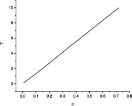

1.  [Download: Download high-res image (30KB)](https://ars.els-cdn.com/content/image/1-s2.0-S0167732222011904-gr12_lrg.jpg "Download high-res image (30KB)")
2.  [Download: Download full-size image](https://ars.els-cdn.com/content/image/1-s2.0-S0167732222011904-gr12.jpg "Download full-size image")

Fig. 12. λ\-line for the model M1 calculated from the direct correlation function given by Eq. [(38)](https://www.sciencedirect.com/science/article/pii/S0167732222011904#e0105) with kc\=0.88424.

In the [perturbation theory](https://www.sciencedirect.com/topics/earth-and-planetary-sciences/perturbation-theory) description of a short-range repulsive potential is usually modelled as a hard sphere serving as the reference system. In the case of soft particles it is suggested to substitute a soft core by some corresponding hard core with an effective radius [\[56\]](https://www.sciencedirect.com/science/article/pii/S0167732222011904#b0280), [\[57\]](https://www.sciencedirect.com/science/article/pii/S0167732222011904#b0285). One way to determine the corresponding hard core diameter σeff is to use the distance at which the pair potential [(1)](https://www.sciencedirect.com/science/article/pii/S0167732222011904#e0005) equals the thermal energy kBT with a specific factor ζ [\[56\]](https://www.sciencedirect.com/science/article/pii/S0167732222011904#b0280), i.e.(43)ν(σkT)\-ζT\=0.Another way to determine σeff is by employing the Barker-Henderson formula [\[58\]](https://www.sciencedirect.com/science/article/pii/S0167732222011904#b0290)(44)σBH\=∫0σdr1\-e\-βν(r),ν(σ)\=0.It is reasonable to presume that the value of the effective diameter should stem from the condition that two particles cannot overlap closer than the distance r\=σeff, i.e. the distance where the value of the [radial distribution](https://www.sciencedirect.com/topics/physics-and-astronomy/radial-distribution) function is close to zero. In [Fig. 13](https://www.sciencedirect.com/science/article/pii/S0167732222011904#f0065), [Fig. 14](https://www.sciencedirect.com/science/article/pii/S0167732222011904#f0070) we show different estimations of the effective hard core diameter by employing expression [(43)](https://www.sciencedirect.com/science/article/pii/S0167732222011904#e0110) at ζ\=1 and ζ\=4 as well as the Barker-Henderson recipe [(44)](https://www.sciencedirect.com/science/article/pii/S0167732222011904#e0115). We analyze the curves of the radial distribution functions given by Eqs. [(35)](https://www.sciencedirect.com/science/article/pii/S0167732222011904#e0090), [(36)](https://www.sciencedirect.com/science/article/pii/S0167732222011904#e0095) relative to different σeff in order to determine the maximum distance, at which the RDF takes on a value close to zero. One can infer that the best approximation corresponds to expression [(43)](https://www.sciencedirect.com/science/article/pii/S0167732222011904#e0110) with ζ\=4. We, therefore, find the value of the effective hard core diameter from the solution of the following equation(45)ν(σeff)\=4T.Hence, in the framework of the random phase approximation the direct correlation function can be presented as the sum of two parts(46)c̃(k)\=c̃HS(k)+c̃3Y(k).One part is the effective hard core contribution [\[59\]](https://www.sciencedirect.com/science/article/pii/S0167732222011904#b0295)(47)c̃HS\=\-4πq3a1sinq\-qcosq+6ηa2q2qsinq+(2\-q2)cosq\-2+ηa12q34q(q2\-6)sinq\-(24\-12q2+q4)cosq+24,where q\=kσ is a dimensionless wave number, η\=ρπσ3/6 is the packing fraction, and(48)a1\=(1+2η)2(1\-η)4,a2\=\-(1+η/2)2(1\-η)4.The other part of the direct correlation function comes from the long-range potential and can be calculated as(49)c̃3Y(k)\=\-4πk∫σ∞rsin(kr)βν(r)dr\=\-4πβ∑l\=13Ale\-αlσ{kcoskσ+αlsinkσ}{αm2αn2+k2(αm2+αn2)+k3},where m,n∈{1,2,3} and l≠m≠n.

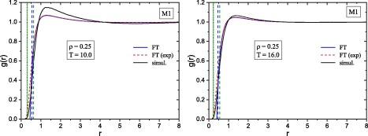

1.  [Download: Download high-res image (150KB)](https://ars.els-cdn.com/content/image/1-s2.0-S0167732222011904-gr13_lrg.jpg "Download high-res image (150KB)")
2.  [Download: Download full-size image](https://ars.els-cdn.com/content/image/1-s2.0-S0167732222011904-gr13.jpg "Download full-size image")

Fig. 13. Estimations of the effective hard core diameter for model M1. The vertical lines mark effective hard core diameters with the dotted green lines corresponding to the expression [(43)](https://www.sciencedirect.com/science/article/pii/S0167732222011904#e0110) at ζ\=4 (Left panel: σkT\=0.30, right panel: σkT\=0.23), the blue dashed line stemming from the same expression at ζ\=1 (Left panel: σkT\=0.55, right panel: σkT\=0.46), and the dashed green line obtained from expression [(44)](https://www.sciencedirect.com/science/article/pii/S0167732222011904#e0115) (Left panel: σBH\=0.63, right panel: σBH\=0.55). The blue solid lines depict the radial distribution function given by Eq. [(35)](https://www.sciencedirect.com/science/article/pii/S0167732222011904#e0090), the red dashed lines correspond to approximation [(36)](https://www.sciencedirect.com/science/article/pii/S0167732222011904#e0095), and the black solid curves come from the MC simulations data.

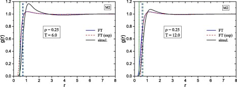

1.  [Download: Download high-res image (147KB)](https://ars.els-cdn.com/content/image/1-s2.0-S0167732222011904-gr14_lrg.jpg "Download high-res image (147KB)")
2.  [Download: Download full-size image](https://ars.els-cdn.com/content/image/1-s2.0-S0167732222011904-gr14.jpg "Download full-size image")

Fig. 14. Effective hard core estimations as in [Fig. (13)](https://www.sciencedirect.com/science/article/pii/S0167732222011904#f0065) for model M2. Left panel: σkT\=0.48 at ζ\=4,σkT\=0.71 at ζ\=1,σBH\=0.76. Right panel: σkT\=0.37 at ζ\=4,σkT\=0.60 at ζ\=1,σBH\=0.67.

In [Fig. (15)](https://www.sciencedirect.com/science/article/pii/S0167732222011904#f0075) left panel, we show the structure factors for models M1 and M2 with the effective hard core diameter determined from Eq. [(45)](https://www.sciencedirect.com/science/article/pii/S0167732222011904#e0120). One can see distinct pre-peaks at small k≠0 signaling the presence of microphase formation in the system. On the right panel of [Fig. (15)](https://www.sciencedirect.com/science/article/pii/S0167732222011904#f0075) we show the respective λ\-lines for the models M1 and M2. Both curves have bell-like shapes as commonly expected for systems with a SALR-type potential [\[25\]](https://www.sciencedirect.com/science/article/pii/S0167732222011904#b0125), [\[31\]](https://www.sciencedirect.com/science/article/pii/S0167732222011904#b0155), [\[32\]](https://www.sciencedirect.com/science/article/pii/S0167732222011904#b0160) which is consistent with our preliminary findings obtained from the simulations. We also note a non-monotonous form of the high density branch of the λ\-line exhibiting reentrant behaviour, which is related to temperature dependence of the effective hard core diameter used to describe a 3Y fluid within the perturbation theory.

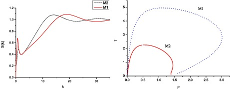

1.  [Download: Download high-res image (96KB)](https://ars.els-cdn.com/content/image/1-s2.0-S0167732222011904-gr15_lrg.jpg "Download high-res image (96KB)")
2.  [Download: Download full-size image](https://ars.els-cdn.com/content/image/1-s2.0-S0167732222011904-gr15.jpg "Download full-size image")

Fig. 15. Left: structure factors for models M1 and M2 at ρ\=0.25,T\=10. Right: λ\-lines for models M1 and M2.

We conclude that a correct description of emergence of inhomogeneous phases in soft core fluids such as a 3Y fluid requires one to take into account the excluded volume effects by introducing an effective hard core diameter. At the same time, the homogeneous phase can be studied to some extent without considering an effective hard core. Having the knowledge of the location of region where there is no microphase formation and the fluid is uniform, we can safely apply the expressions for the structural properties derived from the field-theoretical approach by substituting the values of the density and the temperature well above the λ\-lines. In this context, another point to consider is related to the vapor-liquid phase transition curves. One way to determine the location of the critical region is to construct the spinodals from the condition(50)ρc̃(k\=0,{ρ,T})\=1and see where the critical point lies with respect to the λ\-lines. However, the model [(46)](https://www.sciencedirect.com/science/article/pii/S0167732222011904#e0125) yields no solutions for Eq. [(50)](https://www.sciencedirect.com/science/article/pii/S0167732222011904#e0135) for either M1 or M2 model. This means that the model fluid studied in this paper does not exhibit vapor-liquid phase transition.

## 6\. Density profiles at a hard wall

In this section we study a three-Yukawa fluid with competing interactions in the vicinity of a hard wall. The potential of interaction between the wall and a particle is taken to be infinite when the distance between them is negative and zero elsewhere.

As expression [(10)](https://www.sciencedirect.com/science/article/pii/S0167732222011904#e0310) contains the field ρMF(r1), one can readily see that in the framework of the FT formalism spatially structured systems can be examined even in the framework of the simplest mean field approximation.

From the mean field condition [(8)](https://www.sciencedirect.com/science/article/pii/S0167732222011904#e0030) we derive the following equation(51)lnρ(r1)ρb+V1(r1)+V2(r1)+V3(r1)\=λwhere potentials Vi(r1) are defined as(52)Vi(r1)\=β∫ρ(r2)Airexp(\-αir)dr2.We put(53)λ≡V1b+V2b+V3b,where Vib are the values of potentials Vi(r1) in the bulk(54)Vib\=ϰi2αi2,ϰi2≡4πρbβAi, and we denote the density of the fluid in the bulk by ρb to distinguish it from the distance-dependent density ρ(r) within the interface between the wall and the bulk region.

Given the translational invariance of the system in the directions parallel to the wall, all the distance-dependent functions in the equations above are essentially functions of the distance _z_ in the direction perpendicular to the wall. In consequence, from Eq. [(51)](https://www.sciencedirect.com/science/article/pii/S0167732222011904#e0140) we have the following equation for the density profile(55)ρ(z)\=ρbexp\-\[V1(z)\-V1b\]\-\[V2(z)\-V2b\]\-\[V3(z)\-V3b\].Eq. [(55)](https://www.sciencedirect.com/science/article/pii/S0167732222011904#e0160) is an integral equation of the Euler-Lagrange type. Numerical solution of this equation provides the mean field approximation for the density profile of the fluid.

The density profile can also be estimated in an explicit analytical form. To this end, we approximate the exponent in Eq. [(55)](https://www.sciencedirect.com/science/article/pii/S0167732222011904#e0160) as(56)ρ(z)\=ρb1\-\[V1(z)\-V1b\]\-\[V2(z)\-V2b\]\-\[V3(z)\-V3b\].We have solved this equation analytically and arrived at the following expression for the linearized density profile (the details of calculations are provided in the Appendix 2):(57)ρ(z)ρb\=1\-r¯10+r¯20+r¯30e\-λ0z\-e\-λzλr¯11+r¯21+r¯31\-μr¯12+r¯22+r¯32cosμz\-μr¯11+r¯21+r¯31+λr¯12+r¯22+r¯32sinμz,where(58)r¯11\=\-ϰ322α32+ϰ122α12K30\-AμK30+λK3112\-μK3212\-λK30+λK3111\-μK3211\-BμK30+λK3112\-μK3212,(59)r¯12\=A\-Br¯11,(60)r¯lm\=2λ2+μ2Klm11r11+Klm12r12,lm\={21,22,31,32},(61)r¯10\=\-ϰ122α12\-λr¯11+μr¯12\=\-ϰ122α12+μA\-λ+μBr¯11,(62)r¯20\=\-K20c10/λ0,(63)r¯30\=\-K30c10/λ0,(64)K2111\=1+κ¯12ϰ12+(2λμ)2ϰ12κ¯22+ϰ221+κ¯22ϰ22+(2λμ)2ϰ22κ¯22+ϰ22(65)K2112\=2λμϰ12\-2λμκ¯12+ϰ12κ¯22+ϰ22ϰ121+κ¯22ϰ22+(2λμ)2ϰ22κ¯22+ϰ22,(66)K2211\=ϰ22ϰ22+κ¯22\-2λμϰ12+2λμϰ22K2111,(67)K2212\=ϰ22ϰ22+κ¯221+κ¯12ϰ12+2λμϰ22K2112,(68)K3111\=1ϰ22\-ϰ22+κ¯22K2111+2λμK2211,(69)K3112\=1ϰ22κ¯22K2112+2λμK2212,(70)K3211\=1ϰ22κ¯22K2211\-2λμK2111,(71)K3212\=1ϰ22\-ϰ22+κ¯22K2212\-2λμK2112,(72)K20\=(λ02\-α12)ϰ22(λ02\-α22)ϰ12,(73)K30\=(λ02\-α12)ϰ12(λ02\-α22)λ02\-α22\-ϰ22\-1,(74)A\=1μK20+λK2112\-μK2212\-ϰ222α22+ϰ122α12K20,(75)B\=1μK20+λK2112\-μK2212\-λK20+λK2111\-μK2211,(76)κ¯j2\=λ2\-μ2\-αj2\-ϰj2,(77)c20\=K20c10,c30\=K30c10.As was the case with the pair correlation function [(18)](https://www.sciencedirect.com/science/article/pii/S0167732222011904#e0070), the function on the RHS of Eq. [(57)](https://www.sciencedirect.com/science/article/pii/S0167732222011904#e0425) is defined by parameters λ0,λ, and μ that shape the exponentially damped oscillatory behavior of the profile.

In [Fig. 16](https://www.sciencedirect.com/science/article/pii/S0167732222011904#f0080), [Fig. 17](https://www.sciencedirect.com/science/article/pii/S0167732222011904#f0085), [Fig. 18](https://www.sciencedirect.com/science/article/pii/S0167732222011904#f0090), [Fig. 19](https://www.sciencedirect.com/science/article/pii/S0167732222011904#f0095), [Fig. 20](https://www.sciencedirect.com/science/article/pii/S0167732222011904#f0100) we display density profile curves provided by the numerical solution of the mean field Eq. [(55)](https://www.sciencedirect.com/science/article/pii/S0167732222011904#e0160) (MF), the analytical expression [(57)](https://www.sciencedirect.com/science/article/pii/S0167732222011904#e0425) corresponding to the linearized mean field approximation (LMF), and test these results against Monte Carlo simulations data (MC). Due to the fact that the numerical solution requires the use of a cutoff radius, for comparison purposes we also present two estimations for the linearized profile with and without the respective value of that cutoff. The results show that theoretical predictions for the profile agree with the simulations well. Moreover, the analytical estimate Eq. [(57)](https://www.sciencedirect.com/science/article/pii/S0167732222011904#e0425) reproduces MC data better than the mean field solution. At high densities the agreement is the best for the first peak and deteriorates at distances farther away from the wall. In all the cases, as the temperature rises the agreement between the theory and the simulations improves. Also, one can note that for all the densities and temperatures considered the theory reproduces very well the locations of the respective minima and maxima of the profile. For the Model M2 we observe significant discrepancy between the contact values of the density. This mismatch can likely be corrected by going beyond the mean field approximation and taking into account fluctuation effects as was done in our earlier study on a two-Yukawa fluid [\[42\]](https://www.sciencedirect.com/science/article/pii/S0167732222011904#b0210).

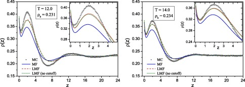

1.  [Download: Download high-res image (233KB)](https://ars.els-cdn.com/content/image/1-s2.0-S0167732222011904-gr16_lrg.jpg "Download high-res image (233KB)")
2.  [Download: Download full-size image](https://ars.els-cdn.com/content/image/1-s2.0-S0167732222011904-gr16.jpg "Download full-size image")

Fig. 16. Density profiles for the Model M1. The symbols correspond to MC simulations; the blue solid lines come from the mean field solution Eq. [(55)](https://www.sciencedirect.com/science/article/pii/S0167732222011904#e0160); the dashed red and green lines correspond to analytical expression [(57)](https://www.sciencedirect.com/science/article/pii/S0167732222011904#e0425) with and without the cutoff radius, respectively.

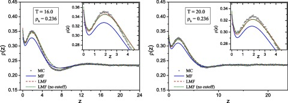

1.  [Download: Download high-res image (211KB)](https://ars.els-cdn.com/content/image/1-s2.0-S0167732222011904-gr17_lrg.jpg "Download high-res image (211KB)")
2.  [Download: Download full-size image](https://ars.els-cdn.com/content/image/1-s2.0-S0167732222011904-gr17.jpg "Download full-size image")

Fig. 17. Density profiles as in [Fig. (16)](https://www.sciencedirect.com/science/article/pii/S0167732222011904#f0080) at higher temperatures as indicated on the graphs.

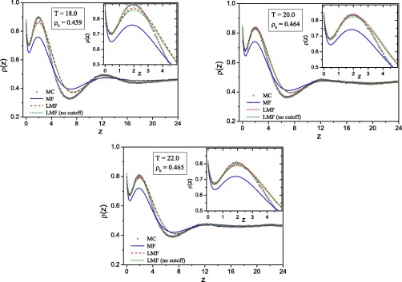

1.  [Download: Download high-res image (333KB)](https://ars.els-cdn.com/content/image/1-s2.0-S0167732222011904-gr18_lrg.jpg "Download high-res image (333KB)")
2.  [Download: Download full-size image](https://ars.els-cdn.com/content/image/1-s2.0-S0167732222011904-gr18.jpg "Download full-size image")

Fig. 18. Density profiles as in [Fig. (16)](https://www.sciencedirect.com/science/article/pii/S0167732222011904#f0080) for a higher density and temperatures as indicated on the graphs.

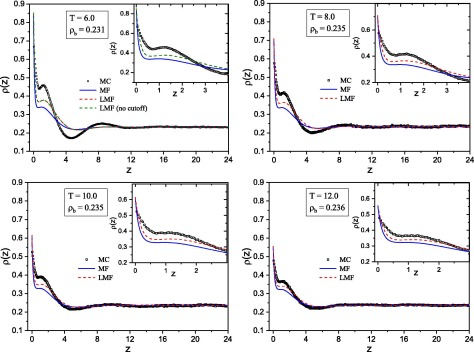

1.  [Download: Download high-res image (359KB)](https://ars.els-cdn.com/content/image/1-s2.0-S0167732222011904-gr19_lrg.jpg "Download high-res image (359KB)")
2.  [Download: Download full-size image](https://ars.els-cdn.com/content/image/1-s2.0-S0167732222011904-gr19.jpg "Download full-size image")

Fig. 19. Density profiles for model M2 as in [Fig. (16)](https://www.sciencedirect.com/science/article/pii/S0167732222011904#f0080) at lower temperatures as indicated on the graphs.

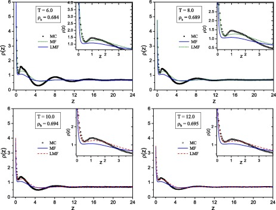

1.  [Download: Download high-res image (319KB)](https://ars.els-cdn.com/content/image/1-s2.0-S0167732222011904-gr20_lrg.jpg "Download high-res image (319KB)")
2.  [Download: Download full-size image](https://ars.els-cdn.com/content/image/1-s2.0-S0167732222011904-gr20.jpg "Download full-size image")

Fig. 20. Density profiles as in [Fig. (19)](https://www.sciencedirect.com/science/article/pii/S0167732222011904#f0095) at a higher density as indicated on the graphs.

The behavior of the density profile is characterized by the split of the first maximum which leads to the formation of a distinct bi-layer close to the wall. We took note of this effect earlier in Section [3](https://www.sciencedirect.com/science/article/pii/S0167732222011904#s0015) as it was present also in the mesostructured systems we considered. The formation of the double peak can be explained by the attractive part of the SALR interaction potential as no similar behavior had been observed in the case of a 2Y fluid at a hard wall [\[42\]](https://www.sciencedirect.com/science/article/pii/S0167732222011904#b0210). Earlier, the double peak in the density profiles of one component fluid with competing interactions near an attractive flat [surface](https://www.sciencedirect.com/topics/immunology-and-microbiology/surface-property) was obtained in [\[38\]](https://www.sciencedirect.com/science/article/pii/S0167732222011904#b0190). In our study we demonstrated that such a behaviour can also occur near an inert hard wall due to purely confining effects, and this is proved by both the theory and simulation results.

## 7\. Conclusions

A fluid interacting with a three-Yukawa (3Y) potential was studied in the bulk and in the vicinity of a hard wall. The amplitudes and the ranges of the respective Yukawa terms were chosen so as to reproduce the short-range attraction and long-range repulsion (SALR) between particles, thus offering a different model of a system with competing interactions. A notable feature of this potential is the softness of the core, which describes the possibility of partial overlap between particles.

Two sets of parameter values for the three-Yukawa potential were considered to construct a SALR potential. A series of Molecular Dynamics (MD) and Monte-Carlo (MC) computer simulations at different temperatures and densities were performed. The results show that the model proposed can describe spontaneous appearance in the system of various mesostructures including lamellar and gyroidal phases, hexagonally packed cylindrical phases, cubically ordered and disordered clusters formed by particles or voids. Furthermore, we observed that these self-assembly effects become more pronounced when the fluid is confined between two inert walls, i.e. close to the walls cluster formation can occur at temperatures higher than those required for micro-segregation in the bulk. As the temperature increases, the clusters vanish, though distinct inhomogeneity near the interface still persists.

A [classical field theory](https://www.sciencedirect.com/topics/physics-and-astronomy/classical-field-theory) was subsequently applied to describe the microstructure of a 3Y fluid at high temperatures and reproduce the density profiles obtained from our simulations. As a first step, we investigated the mesoscopically homogeneous phase in the bulk and close to a hard wall.

For the bulk region, a bicubic equation for generalized screening parameters was derived and solved analytically. Based on these results, explicit analytical expressions for the radial distribution function were derived and compared to the MC data.

We attempted to build a λ\-line describing the region where a transition from a homogeneous 3Y fluid to its inhomogeneous state can occur. We showed that for a soft core 3Y fluid the correct description of mesoscopic phases requires one to take into account excluded volume effects. The structure factor was then calculated by introducing an effective hard core radius characteristic of the system. The λ\-lines were subsequently constructed. The results indicate that the model does indeed describe the possibility of spontaneous emergence of mesostructured phases in the system. Having the knowledge of the phase regions where the fluid is homogeneous, we therefore determined the conditions of applicability of the expressions for the structural properties derived from the field-theoretical approach. To this end, one should substitute the values of the density and the temperature above the λ\-lines found.

The microstructure of a 3Y-fluid in the vicinity of a hard wall was further investigated. In the framework of the mean field approximation an integral equation of the Euler–Lagrange type was obtained for the density profile. Linearization of this equation led to a system of second-order [differential equations](https://www.sciencedirect.com/topics/physics-and-astronomy/operators-mathematics) which were solved using the contact theorem as a boundary condition. The solution of these equations led to explicit analytical expressions for the density profile, which proved to be in very good agreement with the simulations data. Close to the wall we observed a characteristic split of the first maximum of the density profile. We relate the presence of this bilayer to the competing nature of the pair potential between particles, because this specific behavior had not been observed earlier in a simple attractive two-Yukawa fluid. The agreement between theoretical predictions for the profile and the MC simulations data improves with increasing temperature.

## Appendix A.

### A.1. The pair correlation function

The Fourier transform of the pair correlation function can be written as(78)h(k)\=\-βν(k)1+ρβν(k)\=\-1ρP(k)D(k).The numerator and denominator on the RHS of Eq. [(78)](https://www.sciencedirect.com/science/article/pii/S0167732222011904#e0170) equal, respectively,(79)P(k)\=ϰ12(k2+α22)(k2+α32)+ϰ22(k2+α12)(k2+α32)+ϰ32(k2+α12)(k2+α22),(80)D(k)\=k6+k4(ϰ̃12+ϰ̃22+ϰ̃32)+k2ϰ̃12ϰ̃22+ϰ̃12ϰ̃32+ϰ̃22ϰ̃32\-ϰ12ϰ22\-ϰ12ϰ32\-ϰ22ϰ32+α12α22α32+ϰ12α22α32+ϰ22α12α32+ϰ32α12α22,where ϰ̃i2\=ϰi2+αi2.

Taking the inverse Fourier transform of expression [(78)](https://www.sciencedirect.com/science/article/pii/S0167732222011904#e0170), we can find h(r)(81)h(r)\=1(2π)3∫\-∞∞dkh(k)exp\-ikr.In order to perform analytical integration in Eq. [(81)](https://www.sciencedirect.com/science/article/pii/S0167732222011904#e0175), one needs to factorize the denominator D(k). To this end, we need to solve the bicubic equation D(k)\=0.

Equation D(k)\=0 can be presented in a cubic form(82)K3+bK2+cK+d\=0,where(83)K\=k2,(84)b\=(ϰ̃12+ϰ̃22+ϰ̃32),(85)c\=ϰ̃12ϰ̃22+ϰ̃12ϰ̃32+ϰ̃22ϰ̃32\-ϰ12ϰ22\-ϰ12ϰ32\-ϰ22ϰ32,(86)d\=ϰ̃12ϰ̃22ϰ̃32\-ϰ22ϰ32\-ϰ12ϰ22ϰ̃32\-ϰ12ϰ32ϰ̃22+2ϰ12ϰ22ϰ32.The real and complex roots are determined by the discriminant of the cubic equation,(87)Δ\=18bcd\-4b3d+b2c2\-4c3\-27d2.If Δ\=0, then the equation has multiple roots, all of which are real. If Δ<0, then we have one real and two complex conjugate roots. When Δ\>0, the equation has three different real roots.

To solve the cubic equation, we first calculate:(88)Δ0\=b2\-3c(89)Δ1\=2b3\-9bc+27d,(90)C\=Δ1±Δ12\-4Δ0323\=Δ1±\-27Δ23.Here three possible roots exist, of them at least two are complex numbers; any one may be chosen to define _C_.

We consider the case when the cubic Eq. [(82)](https://www.sciencedirect.com/science/article/pii/S0167732222011904#e0180) produces one real solution k02 and a pair of complex conjugate solutions k12 and k22. For _C_ we choose a plus in front of the square root. For the region of parameter values considered, the resulting expression under the cube root is positive, therefore C can take on three values: a real positive number or one of the two complex conjugate numbers. We choose the real positive root to define _C_:(91)C\=Δ1+\-27Δ23The solution of the cubic equation can be written in a condensed form including all three roots as follows:(92)kj2\=\-13b+ξjC+Δ0ξjC,j∈{0,1,2},where ξ\=\-1/2+i(1/2)3 is a cubic root of unity.

The real solution of the cubic equation emerges at j\=0:(93)k02\=\-13b+C+Δ0CThe complex conjugate solutions appear at j\=1 and j\=2.

For the parameters under consideration, the solution k02 is a negative quantity. Due to this, we introduce a more convenient set of notations(94)λj2\=\-kj2,j∈{0,1,2}.The quantities λj2 are essentially the solutions of the cubic Eq. [(82)](https://www.sciencedirect.com/science/article/pii/S0167732222011904#e0180) but of the opposite sign. Therefore, they can be written as(95)λ02\=13b+C+Δ0C,(96)λ12\=M1+M2i,(97)λ22\=M1\-M2i,where(98)M1\=13b\-C2\-Δ02C,(99)M2\=1332C\-Δ0C.Since the quantities λ12 and λ22 are complex conjugate, so are their roots. We can, therefore, write(100)λ1\=λ+iμ,(101)λ2\=λ\-iμ,where(102)λ\=12M12+M22+M11/2,(103)μ\=signum(M2)2M12+M22\-M11/2.The function D(k) can now be written in a factorized form(104)D(k)\=(k2+λ02)(k2+λ12)(k2+λ22)\=(k+iλ0)(k\-iλ0)(k+iλ1)(k\-iλ1)(k+iλ2)(k\-iλ2).The real solutions for the bicubic equation are readily found from Eq. [(93)](https://www.sciencedirect.com/science/article/pii/S0167732222011904#e0200) and equal ±λ0, where(105)λ0\=13b+C+Δ0C.From Eq. [(81)](https://www.sciencedirect.com/science/article/pii/S0167732222011904#e0175), the expression for the pair correlation function is(106)h(r)\=\-12πρH0exp(\-λ0r)r+H1cosμr+H2sinμrexp(\-λr)r,with(107)H0\=12λ04\-2λ02(λ2\-μ2)+(λ2+μ2)2∑i\=13ϰi2(αj2\-λ02)(αk2\-λ02),(108)H1\=18μ2λ2+2λ02‾2∑i\=13ϰi2\-αj2‾αk2‾+λ02‾(αj2‾+αk2‾)+4μ2λ2,(109)H2\=116μ3λ3+4μλλ02‾2∑i\=13ϰi24μ2λ2(αj2‾+αk2‾)+λ02‾(αj2‾αk2‾\-4μ2λ2),where j,k∈{1,2,3} with i≠j≠k, and we use the bar to denote shifted quantities (…)¯\=(…\-λ2+μ2).

### A.2. Analytical expression for the density profile

The gradient of Eq. [(51)](https://www.sciencedirect.com/science/article/pii/S0167732222011904#e0140) gives(110)∇ρ(r)ρ(r)\-E1(r)\-E2(r)\-E3(r)\=0,where we define an equivalent of the electric field by(111)Ei(r1)≡\-∇Vi(r1);Due to the properties of the Yukawa potential we can write(112)▵\-αi2Vi(r)\=\-4πβAiρ(r).Given the translational invariance of the system in the directions parallel to the wall, all the distance-dependent functions in the Eqs. [(110)](https://www.sciencedirect.com/science/article/pii/S0167732222011904#e0220), [(111)](https://www.sciencedirect.com/science/article/pii/S0167732222011904#e0225), [(112)](https://www.sciencedirect.com/science/article/pii/S0167732222011904#e0230) are essentially functions of the distance _z_ in the direction perpendicular to the wall. In consequence, from these equations we obtain a set of seven differential equations with seven unknown functions ρ(z),E1(z),E2(z), E3(z), V1(z),V2(z),V3(z):(113)∂ρ(z)∂z\=ρ(z)E1(z)+E2(z)+E3(z),(114)∂Vi(z)∂z\=\-Ei(z),(115)∂Ei(z)∂z\=\-αi2Vi(z)+ϰi2ρbρ(z).Eq. [(56)](https://www.sciencedirect.com/science/article/pii/S0167732222011904#e0165) leads to a linearized system of equations(116)ρ′(z)\=ρbE1(z)+E2(z)+E3(z),(117)Vi′(z)\=\-Ei(z),(118)Ei′(z)\=\-αi2Vi(z)+ϰi2ρbρ(z).In turn, this system can be reduced to a system of three second-order differential equations(119)E1″(z)\=E1(z)ϰ12+α12+\[E2(z)+E3(z)\]ϰ12;(120)E2″(z)\=\[E1(z)+E3(z)\]ϰ22+E2(z)α22+ϰ22;(121)E3″(z)\=\[E1(z)+E2(z)\]ϰ32+E3(z)α32+ϰ32,or in the matrix form(122)E″\=AE,where(123)E\=E1(z)E2(z)E3(z),A\=ϰ12+α12ϰ12ϰ12ϰ22α22+ϰ22ϰ22ϰ32ϰ32α32+ϰ32Matrix A can be presented in the diagonal form as(124)A\=PDP\-1where(125)D\=Λ0000Λ1000Λ2.The coefficients Λi are the eigenvalues of the matrix A. Denoting the identity matrix as I, we can find these eigenvalues as the roots of the characteristic polynomial of A, i.e. from the equation(126)detA\-ΛI\=0.In our case, this reduces to solving the equation(127)Λ3\-Λ2(ϰ̃12+ϰ̃22+ϰ̃32)+Λϰ̃12ϰ̃22+ϰ̃12ϰ̃32+ϰ̃22ϰ̃32\-ϰ12ϰ22\-ϰ12ϰ32\-ϰ22ϰ32\-ϰ̃12ϰ̃22ϰ̃32\-ϰ22ϰ32+ϰ12ϰ22ϰ̃32+ϰ12ϰ32ϰ̃22\-2ϰ12ϰ22ϰ32\=0,where ϰ̃i2\=ϰi2+αi2.

Eq. [(127)](https://www.sciencedirect.com/science/article/pii/S0167732222011904#e0695) can be presented as(128)Λ3\-bΛ2+cΛ\-d\=0,where the coefficients b,c, and _d_ are given by expressions [(84)](https://www.sciencedirect.com/science/article/pii/S0167732222011904#e0550), [(85)](https://www.sciencedirect.com/science/article/pii/S0167732222011904#e0555), [(86)](https://www.sciencedirect.com/science/article/pii/S0167732222011904#e0560).

Comparing polynomials [(128)](https://www.sciencedirect.com/science/article/pii/S0167732222011904#e0260), [(82)](https://www.sciencedirect.com/science/article/pii/S0167732222011904#e0180), we note that the coefficients in front of the variables of the same powers are identical by the absolute value but alternate their signs. One can show, that in such a case the roots of the two polynomials are equal by the absolute value but have opposite signs. Hence, due to the definitions [(94)](https://www.sciencedirect.com/science/article/pii/S0167732222011904#e0205), we can readily see that parameters λ02,λ12, and λ22, given by Eqs. [(95)](https://www.sciencedirect.com/science/article/pii/S0167732222011904#e0580), [(96)](https://www.sciencedirect.com/science/article/pii/S0167732222011904#e0585), are also the three eigenvalues of the matrix A.

As a result, the general solution for E1(z), for instance, is(129)E1(z)\=c̃10eλ0z+c10e\-λ0z+C∼1e(λ+μi)z+C1e(\-λ+μi)z+C∼2e(λ\-μi)z+C2e(\-λ\-μi)z(130)\=c10e\-λ0z+C1e(\-λ+μi)z+C2e(\-λ\-μi)z,where we leave only the terms with negative λ0z and λz in the exponents due to the fact that λ0 and λ are positive and the function E(z) has to vanish in the bulk.

For the field E1(z) to have a physical meaning, the coefficients C1 and C2 must be complex conjugate as well. From the system of equations [(119)](https://www.sciencedirect.com/science/article/pii/S0167732222011904#e0680) we can tell that the functions E2(z) and E3(z) are of a form similar to that of [(130)](https://www.sciencedirect.com/science/article/pii/S0167732222011904#e0710). We can therefore write the functions Ei(z) as(131)E1(z)\=c10e\-λ0z+r11+r12ie(\-λ+μi)z+r11\-r12ie(\-λ\-μi)z(132)E2(z)\=c20e\-λ0z+r21+r22ie(\-λ+μi)z+r21\-r22ie(\-λ\-μi)z(133)E3(z)\=c30e\-λ0z+r31+r32ie(\-λ+μi)z+r31\-r32ie(\-λ\-μi)zBecause the system of Eqs. [(119)](https://www.sciencedirect.com/science/article/pii/S0167732222011904#e0680) is homogeneous, we essentially have three unknown coefficients, for instance c10,r11,r12, and we can use any pair of Eqs. [(119)](https://www.sciencedirect.com/science/article/pii/S0167732222011904#e0680) to express the rest of the coefficients in terms of these unknowns. Using expressions [(131)](https://www.sciencedirect.com/science/article/pii/S0167732222011904#e0715) and equating the real and the imaginary parts of the coefficients in front of the same _z_\-dependent functions on the LHS and RHS of Eqs. [(119)](https://www.sciencedirect.com/science/article/pii/S0167732222011904#e0680), we obtain two systems of equations - one for the coefficients in front of the functions exp\[(\-λ±μi)z\] and one for the function exp\[\-λ0z\]. In the first case we have the following equations(134)κ¯12r11+2λμr12\-ϰ12r21\-ϰ12r31\=0(135)κ¯12r12\-2λμr11\-ϰ12r22\-ϰ12r32\=0(136)κ¯22r21+2λμr22\-ϰ22r11\-ϰ22r31\=0(137)κ¯22r22\-2λμr21\-ϰ22r12\-ϰ22r32\=0(138)κ¯32r31+2λμr32\-ϰ32r11\-ϰ32r21\=0(139)κ¯32r32\-2λμr31\-ϰ32r12\-ϰ32r22\=0,where κ¯j2\=λ2\-μ2\-αj2\-ϰj2.

We can pick any two pairs of these equations and the solution of this system will be the same. Choosing, for instance, the first two pairs, it is convenient to present coefficients r21,r22,r31,r32 in terms of coefficients r11 and r12 as(140)rlm\=Klm11r11+Klm12r12,where(141)K2111\=1+κ¯12ϰ12+(2λμ)2ϰ12κ¯22+ϰ221+κ¯22ϰ22+(2λμ)2ϰ22κ¯22+ϰ22(142)K2112\=2λμϰ12\-2λμκ¯12+ϰ12κ¯22+ϰ22ϰ121+κ¯22ϰ22+(2λμ)2ϰ22κ¯22+ϰ22(143)K2211\=ϰ22ϰ22+κ¯22\-2λμϰ12+2λμϰ22K2111(144)K2212\=ϰ22ϰ22+κ¯221+κ¯12ϰ12+2λμϰ22K2112(145)K3111\=1ϰ22\-ϰ22+κ¯22K2111+2λμK2211(146)K3112\=1ϰ22κ¯22K2112+2λμK2212(147)K3211\=1ϰ22κ¯22K2211\-2λμK2111(148)K3212\=1ϰ22\-ϰ22+κ¯22K2212\-2λμK2112For the second system of equations we have three equations(149)λ02c10\=α12+ϰ12c10+ϰ12c20+c30(150)λ02c20\=α22+ϰ22c20+ϰ22c10+c30(151)λ02c30\=α32+ϰ32c30+ϰ32c20+c10.Choosing any two of these equations, and due to the fact the determinant of the homogeneous system is zero, we can express the coefficients c20 and c30 in terms of c10 as(152)c20\=K20c10,c30\=K30c10.,(153)K20\=(λ02\-α12)ϰ22(λ02\-α22)ϰ12(154)K30\=(λ02\-α12)ϰ12(λ02\-α22)λ02\-α22\-ϰ22\-1.The potentials Vi(z) then have the form(155)Vi(z)\=Vib+r¯i0e\-λ0z+e\-λzλr¯i1\-μr¯i2cosμz\-μr¯i1+λr¯i2sinμz,where r¯i0\=\-ci0/λ0,r¯ij\=2rij/(λ2+μ2),i\=1,2,3,j\=1,2.

In our earlier work [\[45\]](https://www.sciencedirect.com/science/article/pii/S0167732222011904#b0225) we showed that in the framework of the mean field approximation of the field theory formalism, for a multi-Yukawa fluid the so-called contact theorem [\[60\]](https://www.sciencedirect.com/science/article/pii/S0167732222011904#b0300), [\[61\]](https://www.sciencedirect.com/science/article/pii/S0167732222011904#b0305), [\[62\]](https://www.sciencedirect.com/science/article/pii/S0167732222011904#b0310) holds true. According to this theorem, the density of the fluid at the wall is determined by the pressure of the fluid in the bulk, i.e.(156)βP\=ρ(0+),where _P_ is the pressure within the mean field approximation:(157)βP\=ρb1+ϰ122α12+ϰ222α22+ϰ322α32.The unknown coefficients r¯10,r¯11 and r¯12 can then be found from the boundary conditions given by the contact theorem [(156)](https://www.sciencedirect.com/science/article/pii/S0167732222011904#e0275). Setting z\=0 in Eq. [(56)](https://www.sciencedirect.com/science/article/pii/S0167732222011904#e0165), we obtain(158)Vib\-Vi(0)\=ϰi22αi2,which results in a system of three equations(159)\-ϰ122α12\=r¯10+λr¯11\-μr¯12,(160)\-ϰ222α22\=r¯20+λr¯21\-μr¯22,(161)\-ϰ322α32\=r¯30+λr¯31\-μr¯32.The solution of this system is(162)r¯11\=\-ϰ322α32+ϰ122α12K30\-AμK30+λK3112\-μK3212\-λK30+λK3111\-μK3211\-BμK30+λK3112\-μK3212(163)r¯12\=A\-Br¯11(164)r¯10\=\-ϰ122α12\-λr¯11+μr¯12\=\-ϰ122α12+μA\-λ+μBr¯11,where(165)A\=1μK20+λK2112\-μK2212\-ϰ222α22+ϰ122α12K20,(166)B\=1μK20+λK2112\-μK2212\-λK20+λK2111\-μK2211.Due to Eq. [(56)](https://www.sciencedirect.com/science/article/pii/S0167732222011904#e0165), the final expression for the linearized density profile is(167)ρ(z)ρb\=1\-r¯10+r¯20+r¯30e\-λ0z\-e\-λzλr¯11+r¯21+r¯31\-μr¯12+r¯22+r¯32cosμz\-μr¯11+r¯21+r¯31+λr¯12+r¯22+r¯32sinμz.