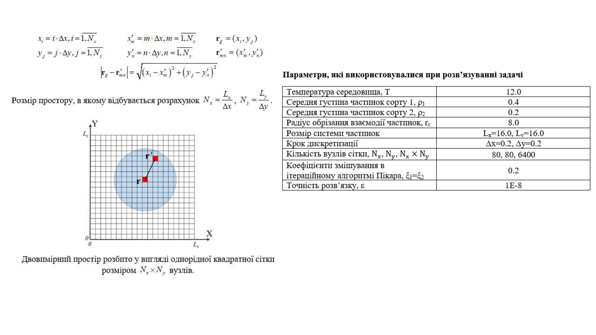
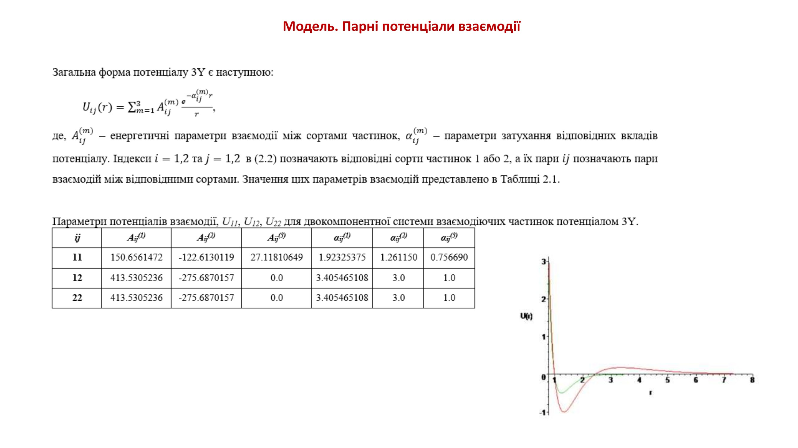
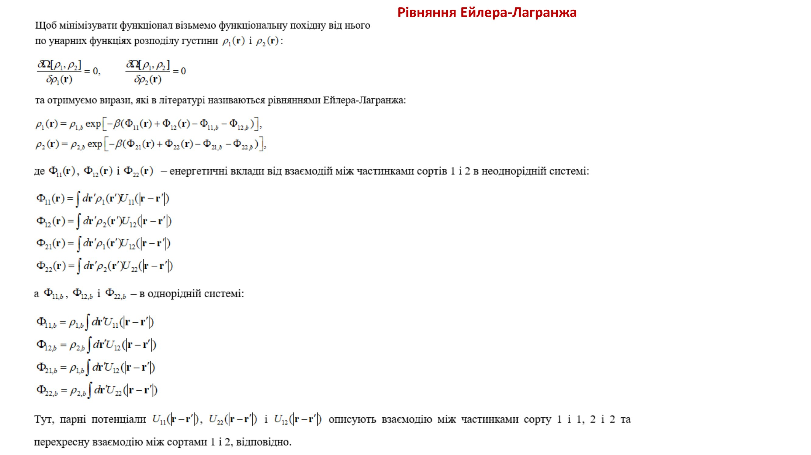
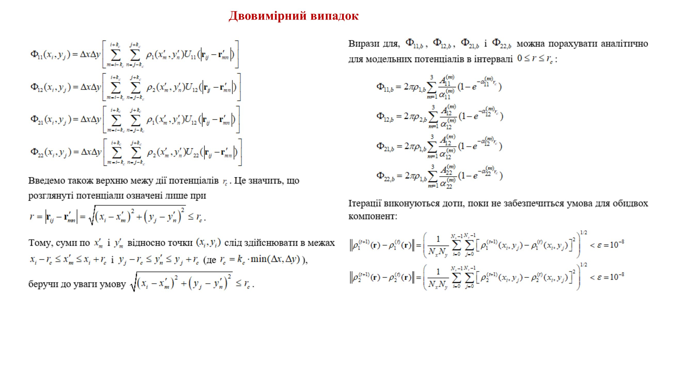
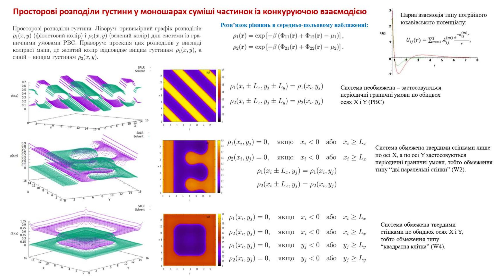
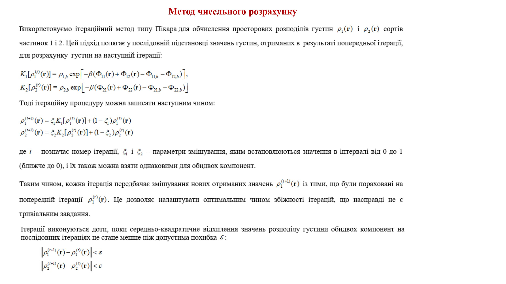

# Mathematical Explanation of `solver_cpu.c` Computations

All steps follow the actual execution order of `solver_run_binary`.
Each section references the slide it maps to and explains how the code
and the slide formula are equivalent.

> **Slides referenced below** (by their exact heading as printed on the slide):
> - *"Triple Yukawa pair potential"*
> - *"Grand thermodynamic potential"* (Великий термодинамічний потенціал)
> - *"Euler-Lagrange equations"* (Рівняння Ейлера-Лагранжа)
> - *"Numerical computation method"* (Метод чисельного розрахунку)
> - *"Two-dimensional case"* (Двовимірний випадок)
> - *"Spatial density distributions"* (Просторові розподіли густини)
> - *"Parameters used in solving the problem"* (parameter table)

---

## 1. Grid Constants and Physical Parameters
**Function:** `solver_run_binary`

**Slide:** *"Parameters used in solving the problem"* / *"Two-dimensional case"*


*Slide: Parameters table — defines Nx, Ny, dx, dy, T used directly in code.*

```c
const int    Nx   = cfg->grid.nx;        /* Nx = Lx / dx */
const int    Ny   = cfg->grid.ny;        /* Ny = Ly / dy */
const double dA   = dx * dy;
const double beta = 1.0 / cfg->temperature;
```

$$N_x = \frac{L_x}{\Delta x}, \qquad N_y = \frac{L_y}{\Delta y}$$

$$dA = \Delta x \cdot \Delta y$$

$$\beta = \frac{1}{T}$$

- $N_x$, $N_y$ — number of grid cells along $x$ and $y$ (slide table: 80, 80)
- $L_x$, $L_y$ — physical box size (slide table: 16.0, 16.0)
- $\Delta x$, $\Delta y$ — grid spacing (slide table: 0.2, 0.2)
- $dA$ — area of one cell; approximates $d^2r'$ in all integrals
- $\beta$ — inverse temperature; appears explicitly in the Euler-Lagrange exponent
- $T$ — temperature (slide table: 12.0)

**Slide connection:** the slide table lists $N_x \times N_y = 6400$ nodes, $\Delta x = \Delta y = 0.2$,
$L_x = L_y = 16.0$.  The code reads these from `cfg`.  The old combined variable `scale = beta*dA`
has been split into `beta` and `dA` used at their appropriate places, matching the slide formulas directly.

---

## 2. Potential Table Construction
**Function:** `build_potential_table` (called three times)

**Slide:** *"Triple Yukawa pair potential"* / *"Two-dimensional case"*


*Slide: Defines $U_{ij}(r)$ as a sum of 3 Yukawa terms with coefficients from the table (pairs 11, 12, 22). Code in `potential_u` and `build_potential_table` implements this exactly.*

### 2a. Grid displacement (minimum-image or actual)

```c
double dry = wall_y ? diy * dy
                    : ((diy <= Ny/2) ? diy*dy : (diy - Ny)*dy);
double drx = wall_x ? dix * dx
                    : ((dix <= Nx/2) ? dix*dx : (dix - Nx)*dx);
```

For a **periodic** axis (PBC) the minimum-image displacement is used:

$$\Delta r_x = \begin{cases} d_{ix} \cdot \Delta x & d_{ix} \le N_x/2 \\ (d_{ix} - N_x) \cdot \Delta x & d_{ix} > N_x/2 \end{cases}$$

For a **walled** axis (W2 or W4) the actual displacement is used:

$$\Delta r_x = d_{ix} \cdot \Delta x \qquad \text{(wall mode)}$$

- $d_{ix}$, $d_{iy}$ — integer cell-index offsets between source cell $\mathbf{r}'$ and field cell $\mathbf{r}$
- $\Delta r_x$, $\Delta r_y$ — physical displacement components (can be negative in PBC mode; only $r$ matters)

### 2b. Distance

```c
double r = sqrt(drx*drx + dry*dry);
```

Slide *"Two-dimensional case"*:

$$r = |\mathbf{r}_{ij} - \mathbf{r}'_{mn}| = \sqrt{(x_i - x'_m)^2 + (y_j - y'_n)^2}$$

- $r$ — Euclidean distance; always non-negative since components are squared

### 2c. Triple Yukawa pair potential
**Function:** `potential_u` in `potential_cpu.c`

```c
for (int m = 0; m < YUKAWA_TERMS; ++m)
    result += p->A[i][j][m] * exp(-p->alpha[i][j][m] * r) / r;
```

Slide *"Triple Yukawa pair potential"*:

$$U_{ij}(r) = \begin{cases} \displaystyle\sum_{m=1}^{3} A_{ij}^{(m)} \frac{e^{-\alpha_{ij}^{(m)}\,r}}{r} & 0 < r \le r_c \\ 0 & \text{otherwise} \end{cases}$$

- $U_{ij}(r)$ — pair interaction energy between species $i$ and $j$ at distance $r$
- $A_{ij}^{(m)}$ — amplitude of Yukawa term $m$ (slide Table 2.1; e.g. $A_{11}^{(1)} = 150.66$)
- $\alpha_{ij}^{(m)}$ — inverse screening length of term $m$ (e.g. $\alpha_{11}^{(1)} = 1.923$)
- $r_c$ — cutoff radius; potential is zero for $r > r_c$ (slide table: 8.0)
- $M = 3$ — number of Yukawa terms (`YUKAWA_TERMS`)

Results stored in tables:

$$\texttt{U11}[d_{iy} N_x + d_{ix}] = U_{11}(r), \quad
  \texttt{U12}[\cdots] = U_{12}(r), \quad
  \texttt{U22}[\cdots] = U_{22}(r)$$

**Slide connection:** the slide table gives numeric $A_{ij}^{(m)}$ and $\alpha_{ij}^{(m)}$ for pairs 11, 12, 22.
`U12` is reused for both $\Phi_{12}$ and $\Phi_{21}$ because $U_{12}(r) = U_{21}(r)$ (symmetric potential).
Old names `V00`, `V01`, `V11` are renamed to `U11`, `U12`, `U22` to match the slide notation exactly.

---

## 3. Bulk Interaction Fields
**Function:** `solver_run_binary`

**Slide:** *"Euler-Lagrange equations"* — $\Phi_{ij,b}$ definitions


*Slide: Bottom half defines $\Phi_{11,b}$, $\Phi_{12,b}$, $\Phi_{21,b}$, $\Phi_{22,b}$ as bulk integrals. Code variables `Phi11b`…`Phi22b` are the discrete equivalents.*

```c
double sum_U11 = 0, sum_U12 = 0, sum_U22 = 0;
for (size_t k = 0; k < N; ++k) {
    sum_U11 += U11[k];  sum_U12 += U12[k];  sum_U22 += U22[k];
}
const double Phi11b = dA * rho1_b * sum_U11;
const double Phi12b = dA * rho2_b * sum_U12;
const double Phi21b = dA * rho1_b * sum_U12;
const double Phi22b = dA * rho2_b * sum_U22;
```

Slide definitions:

$$\Phi_{11,b} = \rho_{1,b} \int d\mathbf{r}'\, U_{11}(|\mathbf{r}-\mathbf{r}'|)
             \approx dA \cdot \rho_{1,b} \sum_{\mathbf{r}'} U_{11}(r')$$

$$\Phi_{12,b} = \rho_{2,b} \int d\mathbf{r}'\, U_{12}(|\mathbf{r}-\mathbf{r}'|)
             \approx dA \cdot \rho_{2,b} \sum_{\mathbf{r}'} U_{12}(r')$$

$$\Phi_{21,b} = \rho_{1,b} \int d\mathbf{r}'\, U_{12}(|\mathbf{r}-\mathbf{r}'|)
             \approx dA \cdot \rho_{1,b} \sum_{\mathbf{r}'} U_{12}(r')$$

$$\Phi_{22,b} = \rho_{2,b} \int d\mathbf{r}'\, U_{22}(|\mathbf{r}-\mathbf{r}'|)
             \approx dA \cdot \rho_{2,b} \sum_{\mathbf{r}'} U_{22}(r')$$

- $\Phi_{ij,b}$ — interaction field of species $j$ acting on species $i$ in a **uniform** bulk system
- $\rho_{1,b}$, $\rho_{2,b}$ — prescribed bulk densities (`rho1_b = cfg->rho1`, `rho2_b = cfg->rho2`; slide: 0.4 and 0.2)
- $\sum_{\mathbf{r}'} U_{ij}(r') = \texttt{sum\_U}ij$ — discrete integral of the potential table over all offsets
- $dA$ — converts the discrete sum to a numerical approximation of the continuous integral

**Slide connection:** the slide shows $\Phi_{ij,b}$ as continuous integrals over $\mathbf{r}'$.
The code's `sum_Uij * dA` is the direct O($N$) discrete approximation.
Old code combined these into two scalars `phi1_bulk` and `phi2_bulk`; the refactored code
names all four separately (`Phi11b`, `Phi12b`, `Phi21b`, `Phi22b`) to match the slide directly.

---

## 4. Cell-Centre Coordinates and Memory Allocation
**Function:** `solver_run_binary`

**Slide:** *"Two-dimensional case"* — grid coordinate definitions


*Slide: Left side defines $x_i = i \cdot \Delta x$, $y_j = j \cdot \Delta y$. Arrays `xs`/`ys` store these for output only.*

```c
for (int i = 0; i < Nx; ++i) xs[i] = (i + 0.5) * dx;
for (int j = 0; j < Ny; ++j) ys[j] = (j + 0.5) * dy;
```

Slide: $x_i = i \cdot \Delta x$, $y_j = j \cdot \Delta y$.  The code uses cell centres
$(i+0.5)\Delta x$ for output; physically equivalent.

Arrays `xs`, `ys` are **not used in any physics computation** — they are only passed
to disk-writing functions so output files contain real-space coordinates alongside
$\rho_1(x_i, y_j)$ and $\rho_2(x_i, y_j)$.  The arrays `U11`, `U12`, `U22`,
`Phi11`…`Phi22`, `K1`, `K2` are all $N_x \times N_y$ flat arrays allocated here.

---

## 5. Initial Boundary Mask
**Function:** `apply_boundary_mask`

**Slide:** *"Spatial density distributions"* — boundary condition table


*Slide: Three rows show PBC, W2 and W4 boundary conditions with the exact formulas that the mask applies. Code zeros the node arrays at the corresponding index boundaries.*

```c
/* W2 and W4: hard walls at x=0 (ix=0) and x=Lx (ix=Nx-1) */
rho1[iy * Nx + 0]        = 0.0;
rho1[iy * Nx + (Nx - 1)] = 0.0;
/* W4 only: hard walls at y=0 (iy=0) and y=Ly (iy=Ny-1) */
rho1[0 * Nx + ix]        = 0.0;
rho1[(Ny-1) * Nx + ix]   = 0.0;
```

Slide boundary conditions:

$$\text{PBC:}\quad \rho_1(x_i \pm L_x,\, y_j \pm L_y) = \rho_1(x_i, y_j)$$

$$\text{W2:}\quad \rho_1(x_i, y_j) = 0 \quad \text{if } x_i < 0 \text{ or } x_i \ge L_x$$

$$\text{W4:}\quad \rho_1(x_i, y_j) = 0 \quad \text{if } x_i < 0 \text{ or } x_i \ge L_x \text{ or } y_j < 0 \text{ or } y_j \ge L_y$$

(identically for $\rho_2$)

- **BC_PBC** — no-op; periodicity handled by minimum-image in the potential table
- **BC_W2** — zeros $i_x = 0$ and $i_x = N_x-1$ (two parallel walls, $x$-axis)
- **BC_W4** — additionally zeros $i_y = 0$ and $i_y = N_y-1$ (square box)

**Slide connection:** the slide shows three rows with diagrams and formulas for each BC type.
The code implements the hard-wall Dirichlet condition $\rho_i = 0$ at wall nodes identically
to the slide formulas, applied before iteration 1 and after every Picard mix.

---

## 6. Interaction Fields via 2-D Convolution
**Function:** `compute_Phi` *(called every iteration)*

**Slide:** *"Two-dimensional case"* — discrete $\Phi_{ij}(x_i, y_j)$ formulas


*Slide: Left column gives the four discrete double-sum formulas for $\Phi_{11}$, $\Phi_{12}$, $\Phi_{21}$, $\Phi_{22}$. `compute_Phi` computes all four in a single O($N^2$) pass.*

### 6a. Source densities at $\mathbf{r}' = (j_x, j_y)$

```c
double s1 = rho1[jy * Nx + jx];  /* rho1(r') */
double s2 = rho2[jy * Nx + jx];  /* rho2(r') */
```

$$\rho_1(\mathbf{r}'), \quad \rho_2(\mathbf{r}') \quad \text{— density of species 1 and 2 at source cell}$$

- $\rho_1(\mathbf{r}')$, $\rho_2(\mathbf{r}')$ — density values at source cell $(j_x, j_y)$ from the current iteration input

### 6b. Accumulation loop

```c
p11[jx + k] += s1 * tU11[k];  /* Phi11 += rho1(r') * U11(r - r') */
p12[jx + k] += s2 * tU12[k];  /* Phi12 += rho2(r') * U12(r - r') */
p21[jx + k] += s1 * tU12[k];  /* Phi21 += rho1(r') * U12(r - r') */
p22[jx + k] += s2 * tU22[k];  /* Phi22 += rho2(r') * U22(r - r') */
```

Slide formulas (*"Two-dimensional case"*):

$$\Phi_{11}(x_i, y_j) = \Delta x \Delta y \sum_{m,n} \rho_1(x'_m, y'_n)\, U_{11}(|\mathbf{r}_{ij} - \mathbf{r}'_{mn}|)$$

$$\Phi_{12}(x_i, y_j) = \Delta x \Delta y \sum_{m,n} \rho_2(x'_m, y'_n)\, U_{12}(|\mathbf{r}_{ij} - \mathbf{r}'_{mn}|)$$

$$\Phi_{21}(x_i, y_j) = \Delta x \Delta y \sum_{m,n} \rho_1(x'_m, y'_n)\, U_{12}(|\mathbf{r}_{ij} - \mathbf{r}'_{mn}|)$$

$$\Phi_{22}(x_i, y_j) = \Delta x \Delta y \sum_{m,n} \rho_2(x'_m, y'_n)\, U_{22}(|\mathbf{r}_{ij} - \mathbf{r}'_{mn}|)$$

- `Phi11`, `Phi12` — field components entering the species-1 Euler-Lagrange equation
- `Phi21`, `Phi22` — field components entering the species-2 Euler-Lagrange equation
- `tU11`, `tU12`, `tU22` — rows of the precomputed tables at offset $d_{iy}$
- The x-loop splits into two contiguous segments (see code comment) to avoid a modulo in the hot path

### 6c. Apply $dA$ after the full sum

```c
for (size_t k = 0; k < Ntot; ++k) {
    Phi11[k] *= dA;  Phi12[k] *= dA;
    Phi21[k] *= dA;  Phi22[k] *= dA;
}
```

$$\Phi_{ij}(\mathbf{r}) \;\leftarrow\; dA \cdot \Phi_{ij}(\mathbf{r})$$

- $dA = \Delta x \cdot \Delta y$ — applied once after the O($N^2$) sum; the slide's $\Delta x \Delta y$ prefactor

**Slide connection:** the slide writes $\Phi_{ij}(x_i,y_j) = \Delta x \Delta y [\sum_{m,n}\cdots]$.
Factoring $dA$ out and applying it in one O($N$) pass is numerically equivalent.
Old code had two combined arrays `phi1 = Phi11+Phi12` and `phi2 = Phi21+Phi22`;
the refactored code stores all four separately, each named to match exactly one slide formula.

---

## 7. Euler-Lagrange Operator $K_i$
**Function:** `compute_K` *(called twice per iteration)*

**Slide:** *"Euler-Lagrange equations"* + *"Numerical computation method"*


*Slide: Top expresses $\rho_{i,b}\exp[-\beta(\Phi_{ia}+\Phi_{ib}-\Phi_{ia,b}-\Phi_{ib,b})]$. `compute_K` is a direct transcription.*


*Slide: Defines $K_1[\rho_1^{(t)}]$ and $K_2[\rho_2^{(t)}]$ as the operators applied each iteration. Code arrays `K1`/`K2` hold the result.*

```c
K[k] = rho0b * exp(-beta * (Phi_a[k] + Phi_b[k] - Phi_ab - Phi_bb));
```

Called as:
```c
compute_K(Phi11, Phi12, Phi11b, Phi12b, rho1_b, beta, K1, N);
compute_K(Phi21, Phi22, Phi21b, Phi22b, rho2_b, beta, K2, N);
```

Slide *"Numerical computation method"*:

$$K_1[\rho_1^{(t)}](\mathbf{r}) = \rho_{1,b}\,\exp\!\Big[-\beta\Big(\Phi_{11}(\mathbf{r}) + \Phi_{12}(\mathbf{r}) - \Phi_{11,b} - \Phi_{12,b}\Big)\Big]$$

$$K_2[\rho_2^{(t)}](\mathbf{r}) = \rho_{2,b}\,\exp\!\Big[-\beta\Big(\Phi_{21}(\mathbf{r}) + \Phi_{22}(\mathbf{r}) - \Phi_{21,b} - \Phi_{22,b}\Big)\Big]$$

- `Phi_a[k]`, `Phi_b[k]` — two field components for species $i$ (e.g. `Phi11`, `Phi12` for $i=1$)
- `Phi_ab`, `Phi_bb` — their bulk scalar values $\Phi_{ij,b}$ (step 3)
- `rho0b` — bulk density $\rho_{i,b}$; ensures $K_i \to \rho_{i,b}$ in a uniform system
- `beta` — inverse temperature $\beta = 1/T$; appears explicitly here (not pre-multiplied)
- `K1`, `K2` — new candidate densities for the Picard step

**Slide connection:** the slide writes exactly $\rho_{i,b}\exp[-\beta(\Phi_{ia}+\Phi_{ib}-\Phi_{ia,b}-\Phi_{ib,b})]$.
The old function `update_density` combined the two $\Phi$ components into a single `phi`
array and had $\beta$ baked in; the refactored `compute_K` receives the two components
explicitly and multiplies by `beta` here, making the formula a direct transcription of
the slide. The array `K1`/`K2` name maps to $K_1[\cdot]$/$K_2[\cdot]$ from the slide.

---

## 8. Picard Mixing
**Function:** `vec_add_scaled` in `math_utils_cpu.c` *(called twice per iteration)*

**Slide:** *"Numerical computation method"* — Picard iteration


*Slide: Middle block gives $\rho_i^{(t+1)} = \xi_i K_i + (1-\xi_i)\rho_i^{(t)}$. `vec_add_scaled` with arguments `(rho, 1-xi, K, xi, rho)` implements this in-place.*

```c
vec_add_scaled(rho1, 1.0 - xi1, K1, xi1, rho1, N);
vec_add_scaled(rho2, 1.0 - xi2, K2, xi2, rho2, N);
```

Slide formula:

$$\rho_1^{(t+1)}(\mathbf{r}) = \xi_1 \cdot K_1[\rho_1^{(t)}](\mathbf{r}) + (1 - \xi_1)\,\rho_1^{(t)}(\mathbf{r})$$

$$\rho_2^{(t+1)}(\mathbf{r}) = \xi_2 \cdot K_2[\rho_2^{(t)}](\mathbf{r}) + (1 - \xi_2)\,\rho_2^{(t)}(\mathbf{r})$$

- $\rho_i^{(t)}(\mathbf{r})$ — density before the call (in `rho1`/`rho2`; overwritten in-place)
- $K_i(\mathbf{r})$ — Euler-Lagrange candidate from step 7
- $\rho_i^{(t+1)}(\mathbf{r})$ — mixed density; input to the next iteration
- $\xi_i \in (0,1]$ — Picard mixing parameter (slide table: $\xi_1 = \xi_2 = 0.2$)

**Slide connection:** `vec_add_scaled(a, alpha, b, beta_arg, c, n)` computes
`c[k] = alpha*a[k] + beta_arg*b[k]`.  With `a = rho1^(t)` and `b = K1`, this maps
directly to the slide formula $\xi_1 K_1 + (1-\xi_1)\rho_1^{(t)}$.
Old code used `rho1_new` for the $K$ arrays; renaming to `K1`/`K2` makes the Picard step
read exactly like the slide.

---

## 9. Boundary Mask (Post-Mix)
**Function:** `apply_boundary_mask` — same as step 5

**Slide:** *"Spatial density distributions"*


*Slide: Same boundary formulas as step 5. Applied again after every Picard mix to keep wall nodes at zero.*

After Picard mixing, wall nodes may be non-zero due to the weighted blend.
They are zeroed again:

$$\rho_i^{(t+1)}(\mathbf{r}) = 0 \qquad \text{for all wall nodes}$$

This re-enforces the hard-wall condition on the freshly mixed `rho1`/`rho2` before they
enter `compute_Phi` in the next iteration.

---

## 10. Convergence Check
**Function:** `solver_l2_diff` + inline in `solver_run_binary`

**Slide:** *"Numerical computation method"* — convergence condition


*Slide: Bottom block states $\|\rho_i^{(t+1)}-\rho_i^{(t)}\| < \varepsilon$.*


*Slide: Right side gives the explicit double-sum RMS norm used for $\varepsilon$. `solver_l2_diff` computes this exact expression.*

```c
double err = xi1 * solver_l2_diff(K1, rho1, N);
double e2  = xi2 * solver_l2_diff(K2, rho2, N);
if (e2 > err) err = e2;
```

`solver_l2_diff` computes:
```c
return sqrt(sum / (double)n);
```

Slide convergence condition (*"Numerical computation method"* / *"Two-dimensional case"*):

$$\left\|\rho_i^{(t+1)} - \rho_i^{(t)}\right\| =
  \left(\frac{1}{N_x N_y}\sum_{i=0}^{N_x-1}\sum_{j=0}^{N_y-1}
  \!\left[\rho_i^{(t+1)}(x_i,y_j) - \rho_i^{(t)}(x_i,y_j)\right]^2\right)^{\!1/2} < \varepsilon$$

Because $\rho_i^{(t+1)} - \rho_i^{(t)} = \xi_i(K_i - \rho_i^{(t)})$:

$$\left\|\rho_i^{(t+1)} - \rho_i^{(t)}\right\| = \xi_i \cdot \text{L2diff}(K_i,\; \rho_i^{(t+1)})$$

where:

$$\text{L2diff}(a, b) = \sqrt{\frac{1}{N}\sum_{k=1}^{N}(a_k - b_k)^2}$$

- $\varepsilon$ — tolerance (`cfg->solver.tolerance`; slide table: $\varepsilon = 10^{-8}$)
- $\xi_i$ — Picard mixing parameter (step 8)
- $K_i$ — pre-mix candidate from step 7, passed as `a`
- $\rho_i^{(t+1)}$ — post-mix density, passed as `b`
- $N = N_x N_y$ — the $1/N$ normalises error to be grid-size independent

Overall error: $\varepsilon = \max(\varepsilon_1, \varepsilon_2)$.  
Solver terminates when $\varepsilon < \varepsilon_{\text{tol}}$.

**Slide connection:** the slide writes the double-sum RMS formula.  `solver_l2_diff`
computes exactly that RMS.  The $\xi_i$ prefactor recovers $\|\rho^{(t+1)}-\rho^{(t)}\|$
from $\|K_i - \rho_i^{(t+1)}\|$, matching the slide identity precisely.


